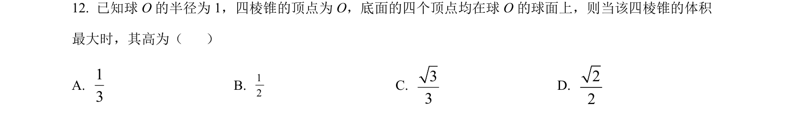
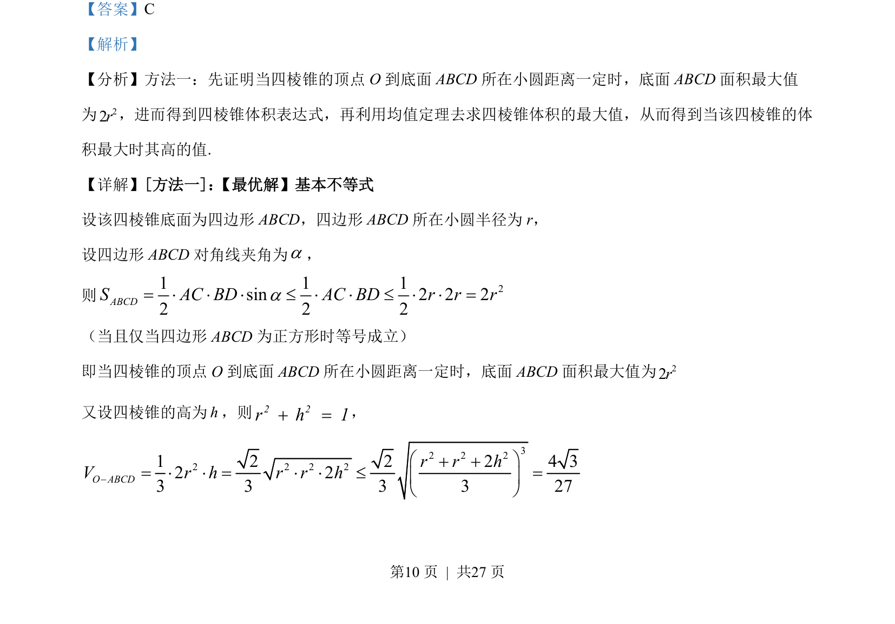
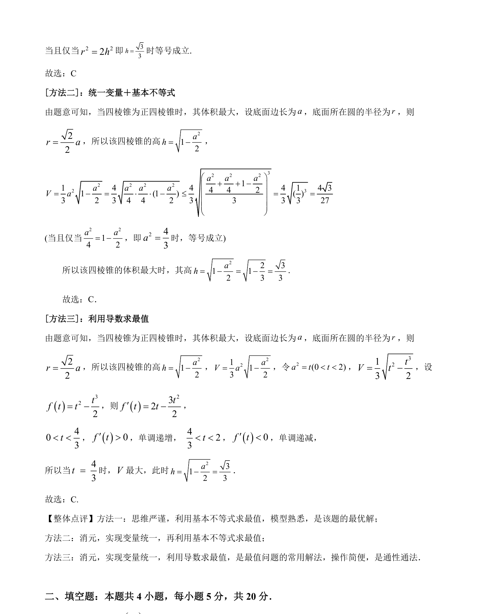

## 题面

## 摘要

本题通过几何分析和均值不等式求四棱锥体积最大值时对应的高。

## 关联考点

- [[066-体积|四棱锥体积]]
- [[295-基本不等式|基本不等式]]
- [[286-函数的最值|最值]]
- [[261-视图与几何体还原|几何体]]

## 答案与解析

> 📄 原 PDF 第 10 页：`素材/真题/吉林/2008-2024·（吉林）数学高考真题/2022年高考数学试卷（文）（全国乙卷）（解析卷）.pdf`

<!-- 题干文本-start -->
## 题干文本
12. 已知球 O 的半径为 1，四棱锥的顶点为 O，底面的四个顶点均在球 O 的球面上，则当该四棱锥的体积
最大时，其高为（    ）
A. 13
B. 12C. 33
D. 22
<!-- 题干文本-end -->

<!-- 解析文本-start -->
## 解析文本
【答案】C
【解析】
【分析】方法一：先证明当四棱锥的顶点 O 到底面 ABCD所在小圆距离一定时，底面 ABCD面积最大值
为22r，进而得到四棱锥体积表达式，再利用均值定理去求四棱锥体积的最大值，从而得到当该四棱锥的体
积最大时其高的值.
【详解】[方法一]： 【最优解】基本不等式
设该四棱锥底面为四边形 ABCD，四边形 ABCD所在小圆半径为 r，
设四边形 ABCD对角线夹角为a，
则 21 1 1sin 2 2 22 2 2ABCDS AC BD AC BD r r ra= × × × £ × × £ × × =
（当且仅当四边形 ABCD为正方形时等号成立）
即当四棱锥的顶点 O 到底面 ABCD所在小圆距离一定时，底面 ABCD面积最大值为22r
又设四棱锥的高为h，则2 2r h 1+ =，
32 2 22 2 2 21 2 2 2 4 32 23 3 3 3 27O ABCDr r hV r h r r h- æ ö+ += × × = × × £ =ç ÷è ø
<!-- 解析文本-end -->
