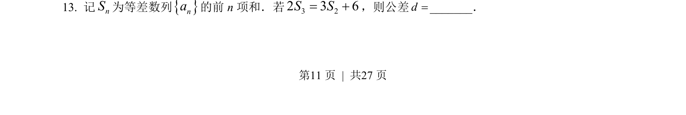
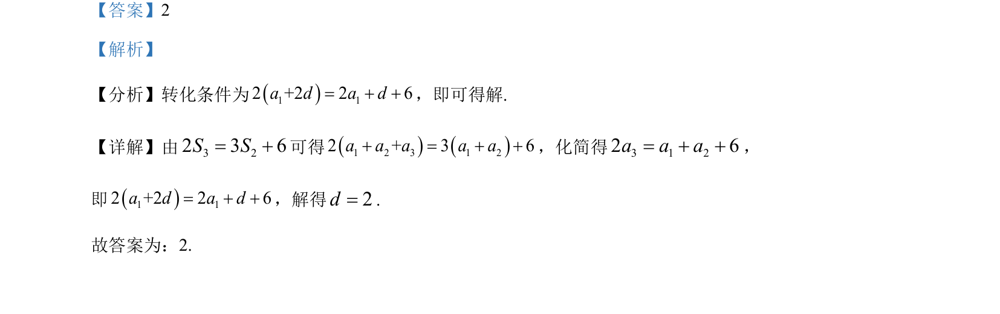

## 题面

## 摘要

已知等差数列前2项和与第3项的关系，求公差。

## 关联考点

- [[356-等差数列概念|等差数列]]
- [[355-等差数列前n项和|前n项和]]
- [[356-等差数列概念|公差]]

## 答案与解析

> 📄 原 PDF 第 11 页：`素材/真题/吉林/2008-2024·（吉林）数学高考真题/2022年高考数学试卷（文）（全国乙卷）（解析卷）.pdf`
