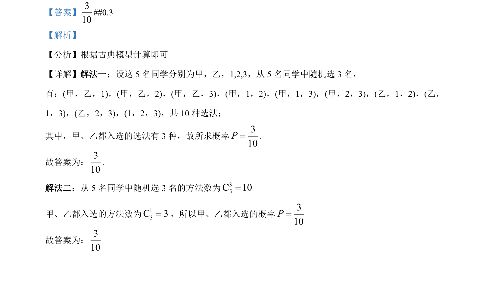

## 题面

## 摘要

5 名同学中随机选 3 名，求甲乙都入选的概率，用古典概型+组合数计算。

## 关联考点

- [[320-古典概型|古典概型]]
- [[504-组合数公式|组合数]]
- [[948-概率计算|概率计算]]

## 答案与解析

> 📄 原 PDF 第 12 页：`素材/真题/吉林/2008-2024·（吉林）数学高考真题/2022年高考数学试卷（文）（全国乙卷）（解析卷）.pdf`

<!-- 题干文本-start -->
## 题干文本
14. 从甲、乙等 5 名同学中随机选 3 名参加社区服务工作，则甲、乙都入选的概率为____________．
<!-- 题干文本-end -->

<!-- 解析文本-start -->
## 解析文本
【答案】310
##0.3
【解析】
【分析】根据古典概型计算即可
【详解】解法一：设这 5 名同学分别为甲，乙，1,2,3，从 5 名同学中随机选 3 名，
有：(甲，乙，1)，(甲，乙，2)，(甲，乙，3)，(甲，1，2)，(甲，1，3)，(甲，2，3)，(乙，1，2)，(乙，
1，3)，(乙，2，3)，(1，2，3)，共 10 种选法；
其中，甲、乙都入选的选法有 3 种，故所求概率310P=.
故答案为：310
.
解法二：从 5 名同学中随机选 3 名的方法数为35C 10=
甲、乙都入选的方法数为13C 3=，所以甲、乙都入选的概率310P=
故答案为：310
<!-- 解析文本-end -->
