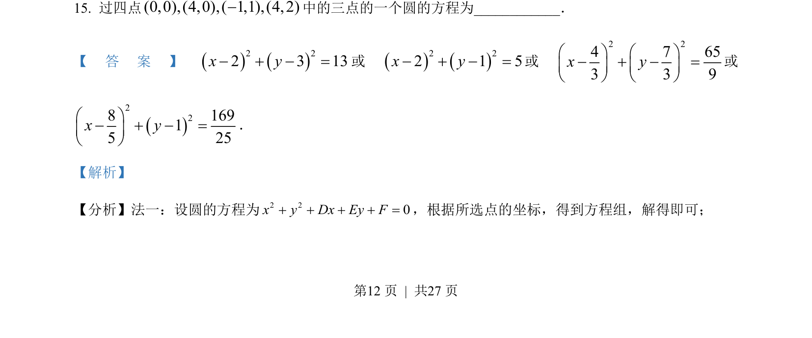

## 题面

## 摘要

过四点中三点求圆的方程，用一般方程 x²+y²+Dx+Ey+F=0 待定系数法。

## 关联考点

- [[372-圆的一般方程|圆的一般方程]]
- [[197-待定系数法|待定系数法]]
- [[三点定圆]]

## 答案与解析

> 📄 原 PDF 第 12 页：`素材/真题/吉林/2008-2024·（吉林）数学高考真题/2022年高考数学试卷（文）（全国乙卷）（解析卷）.pdf`
