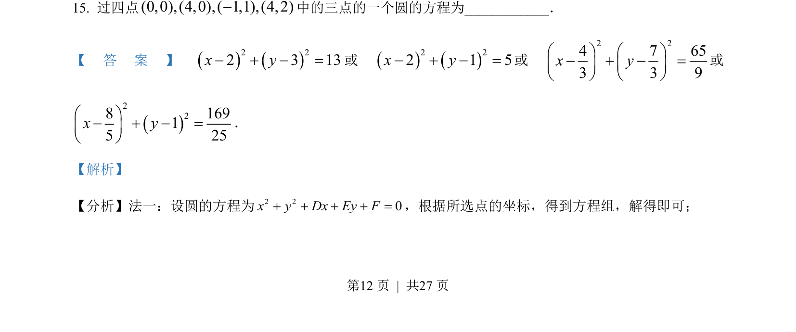
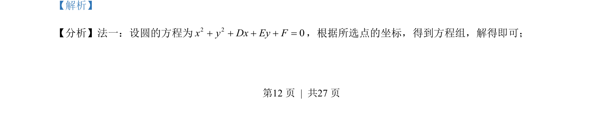
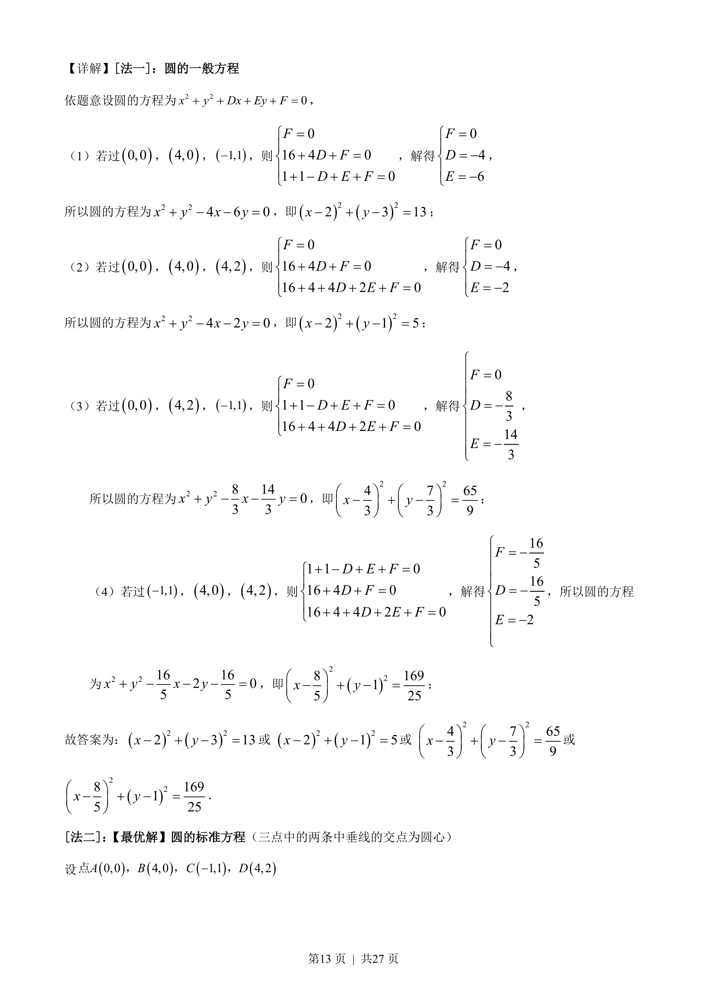
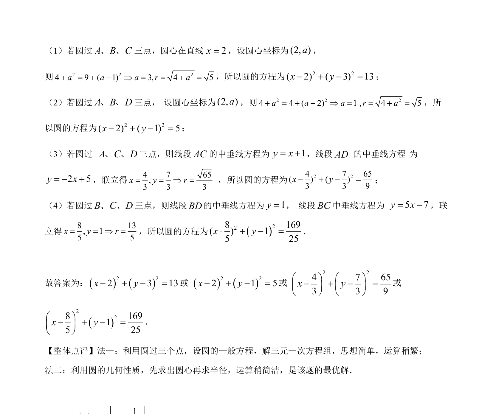

## 题面

## 摘要

过四点中三点求圆的方程，用一般方程 x²+y²+Dx+Ey+F=0 待定系数法。

## 关联考点

- [[372-圆的一般方程|圆的一般方程]]
- [[197-待定系数法|待定系数法]]
- [[1212-三点定圆|三点定圆]]

## 答案与解析

> 📄 原 PDF 第 12 页：`素材/真题/吉林/2008-2024·（吉林）数学高考真题/2022年高考数学试卷（文）（全国乙卷）（解析卷）.pdf`

<!-- 题干文本-start -->
## 题干文本
15. 过四点(0,0),(4,0),( 1,1),(4,2)-中的三点的一个圆的方程为____________．
【 答 案 】()()2 22 3 13x y- + - =或()()2 22 1 5x y- + - =或
2 24 7 653 3 9x yæ ö æ ö- + - =ç ÷ ç ÷è ø è ø
或
()228 16915 25x yæ ö- + - =ç ÷è ø
．
<!-- 题干文本-end -->

<!-- 解析文本-start -->
## 解析文本
【解析】
【分析】法一：设圆的方程为2 20x y Dx Ey F+ + + + =，根据所选点的坐标，得到方程组，解得即可；
<!-- 解析文本-end -->
