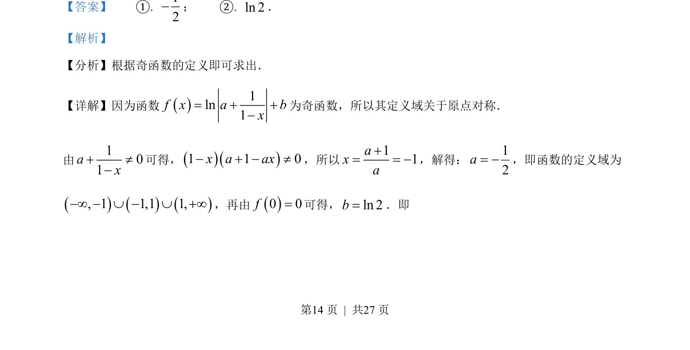
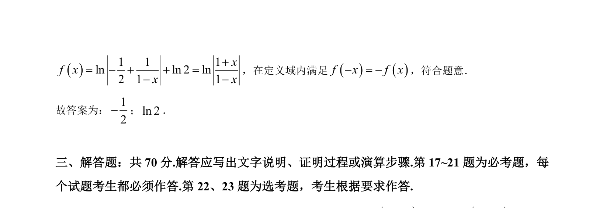

## 题面

## 摘要

本题通过奇函数定义域对称性及f(0)=0求参数值。

## 关联考点

- [[819-奇函数定义|奇函数定义]]
- [[014-对称|定义域对称性]]
- [[298-对数函数|对数函数性质]]

## 答案与解析

> 📄 原 PDF 第 14 页：`素材/真题/吉林/2008-2024·（吉林）数学高考真题/2022年高考数学试卷（文）（全国乙卷）（解析卷）.pdf`

<!-- 题干文本-start -->
## 题干文本
16. 若()1ln1f x a bx+ +-=是奇函数，则=a_____，b=______．
<!-- 题干文本-end -->

<!-- 解析文本-start -->
## 解析文本
【答案】    ①. 12-；    ②. ln 2．
【解析】
【分析】根据奇函数的定义即可求出．
【详解】因为函数()1ln1f x a bx+ +-=为奇函数，所以其定义域关于原点对称．
由101ax+ ¹-
可得，()()1 1 0x a ax- + - ¹，所以11axa+= = -，解得：12a= -，即函数的定义域为
()()(), 1 1,1 1,-¥ - È - È +¥，再由()0 0f=可得，ln 2b=．即
<!-- 解析文本-end -->
