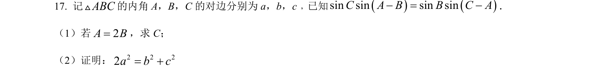
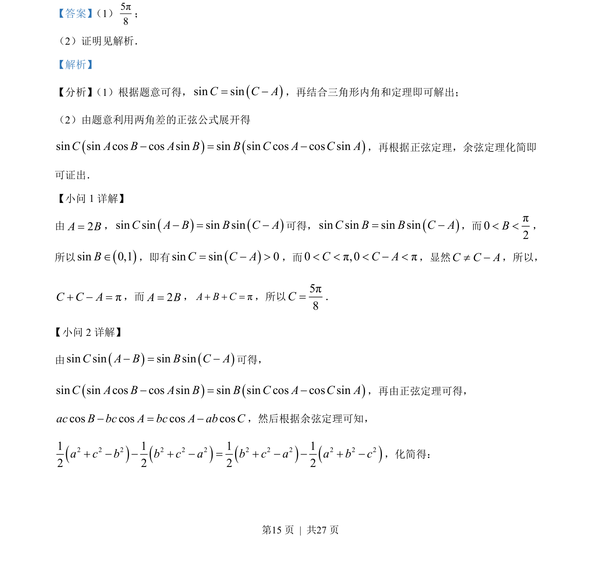

## 题面

## 摘要

本题结合三角形内角和与正弦余弦定理，求解角（C）并证明边关系。

## 关联考点

- [[126-定理|正弦定理]]
- [[126-定理|余弦定理]]
- [[272-三角恒等变换|三角恒等变换]]
- [[147-三角形内角和|三角形内角和]]

## 答案与解析

> 📄 原 PDF 第 15 页：`素材/真题/吉林/2008-2024·（吉林）数学高考真题/2022年高考数学试卷（文）（全国乙卷）（解析卷）.pdf`
