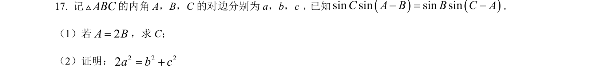
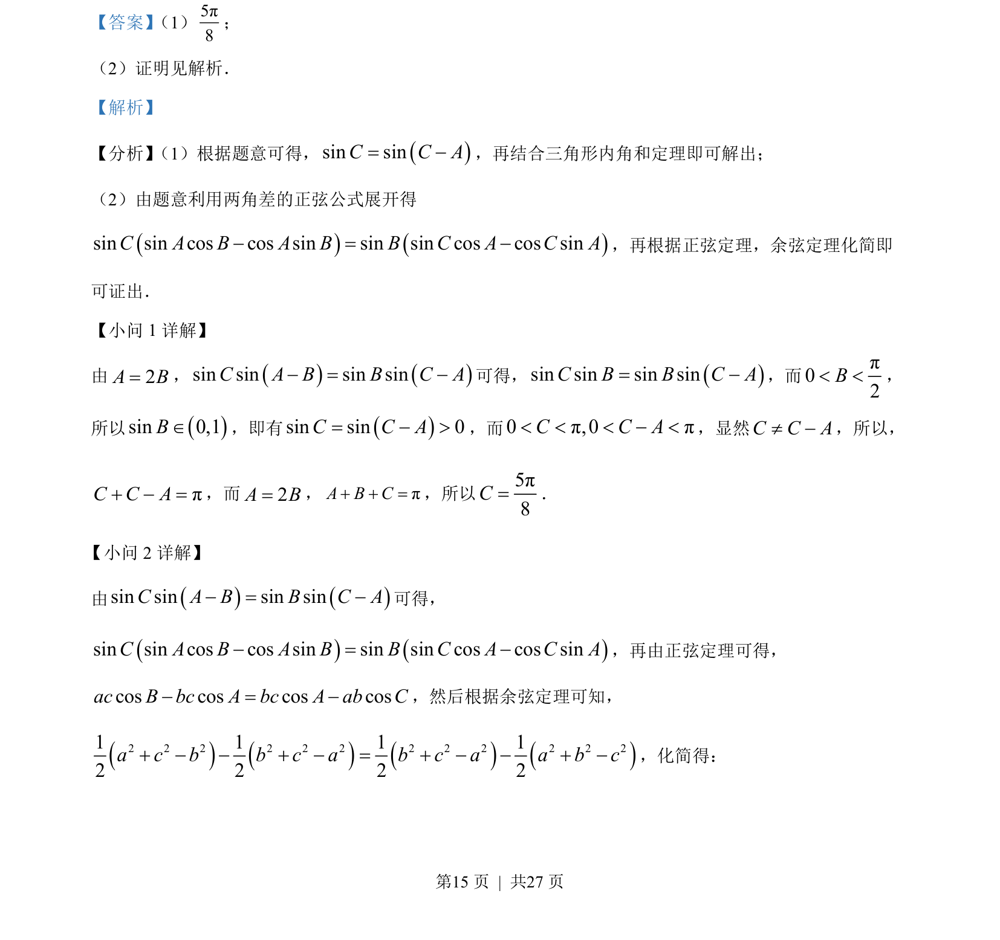
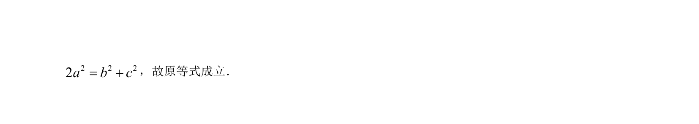

## 题面

## 摘要

本题结合三角形内角和与正弦余弦定理，求解角（C）并证明边关系。

## 关联考点

- [[126-定理|正弦定理]]
- [[126-定理|余弦定理]]
- [[272-三角恒等变换|三角恒等变换]]
- [[147-三角形内角和|三角形内角和]]

## 答案与解析

> 📄 原 PDF 第 15 页：`素材/真题/吉林/2008-2024·（吉林）数学高考真题/2022年高考数学试卷（文）（全国乙卷）（解析卷）.pdf`

<!-- 题干文本-start -->
## 题干文本
17. 记ABCV的内角 A，B，C的对边分别为 a，b，c﹐已知()()sin sin sin sinC A B B C A- = -．
（1）若2A B=，求 C；
（2）证明：2 2 22a b c= +
<!-- 题干文本-end -->

<!-- 解析文本-start -->
## 解析文本
【答案】 （1）5π8；    
（2）证明见解析．
【解析】
【分析】 （1）根据题意可得，()sin sinC C A= -，再结合三角形内角和定理即可解出； 
（2）由题意利用两角差的正弦公式展开得
()()sin sin cos cos sin sin sin cos cos sinC A B A B B C A C A- = -，再根据正弦定理，余弦定理化简即
可证出．
【小问 1 详解】
由2A B=，()()sin sin sin sinC A B B C A- = -可得， ()sin sin sin sinC B B C A= -，而π02B< <，
所以()sin 0,1BÎ，即有()sin sin 0C C A= - >，而0π,0πC C A< < < - <，显然C C A¹ -，所以，
πC C A+ - =，而2A B=， πA B C+ + =，所以5π8C=．
小问 2 详解】
由()()sin sin sin sinC A B B C A- = -可得，
()()sin sin cos cos sin sin sin cos cos sinC A B A B B C A C A- = -，再由正弦定理可得，
cos cos cos cosac B bc A bc A ab C- = -，然后根据余弦定理可知，
()()()()2 2 2 2 2 2 2 2 2 2 2 21 1 1 12 2 2 2a c b b c a b c a a b c+ - - + - = + - - + -，化简得：
【
<!-- 解析文本-end -->
