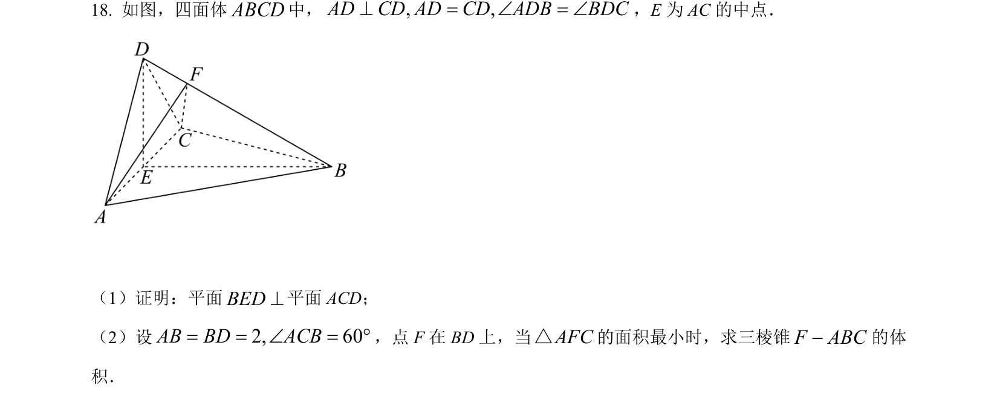
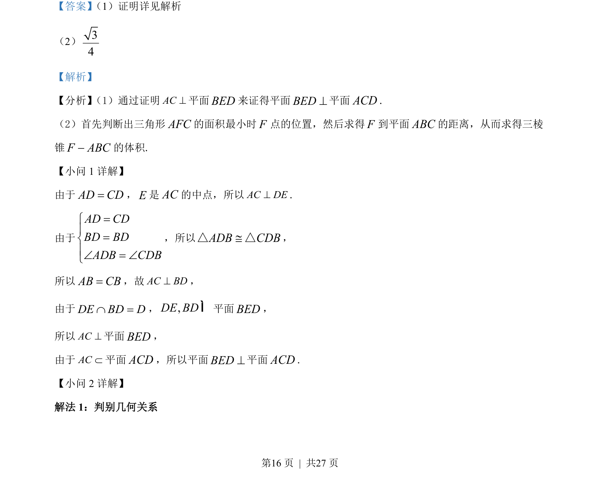
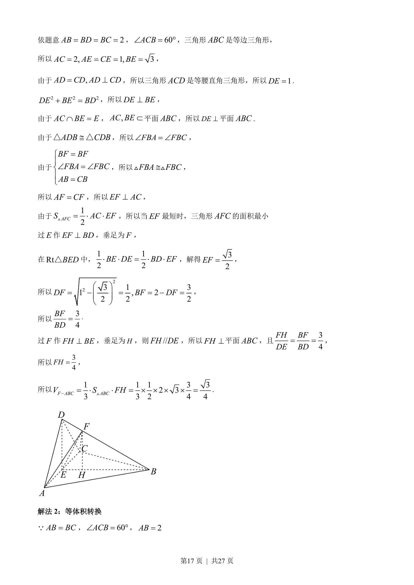
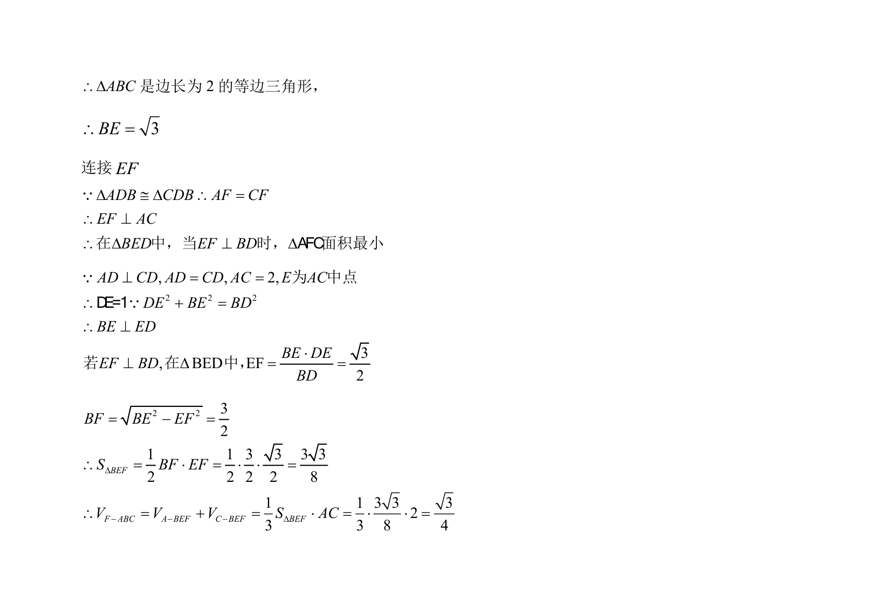

## 题面

## 摘要

本题通过线面垂直证明面面垂直，并结合几何关系求解三棱锥体积。

## 关联考点

- [[线面垂直的判定与性质]]
- [[面面垂直的判定]]
- [[066-体积|三棱锥体积计算]]
- [[空间几何关系]]

## 答案与解析

> 📄 原 PDF 第 16 页：`素材/真题/吉林/2008-2024·（吉林）数学高考真题/2022年高考数学试卷（文）（全国乙卷）（解析卷）.pdf`
