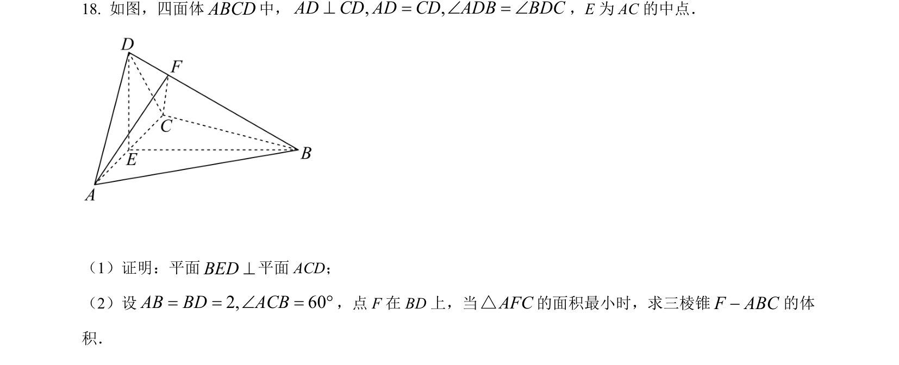
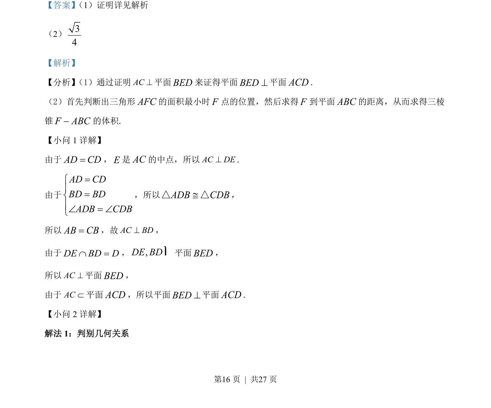
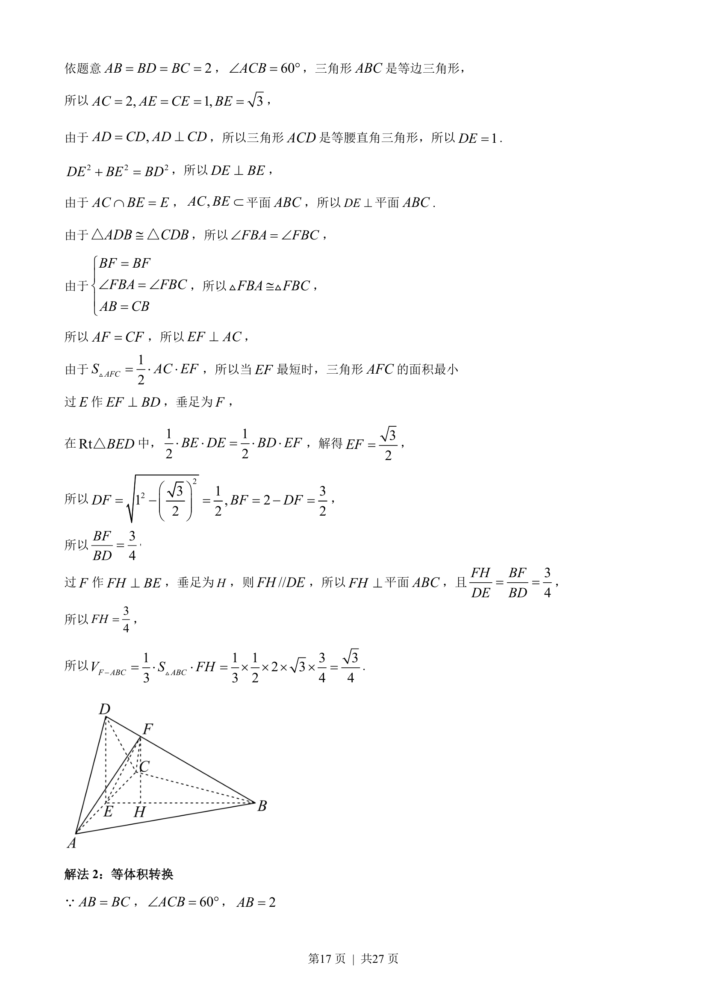
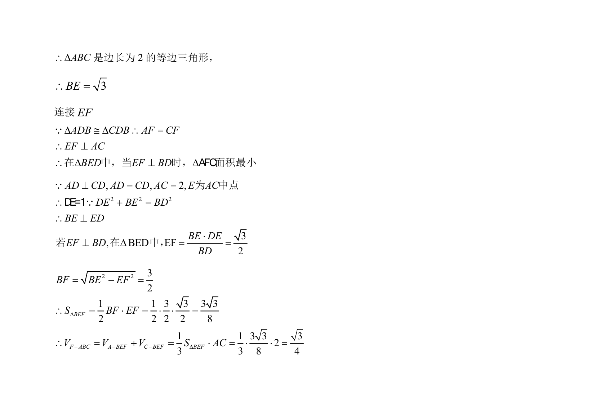

## 题面

## 摘要

本题通过线面垂直证明面面垂直，并结合几何关系求解三棱锥体积。

## 关联考点

- [[1086-线面垂直的判定与性质|线面垂直的判定与性质]]
- [[1149-面面垂直的判定|面面垂直的判定]]
- [[066-体积|三棱锥体积计算]]
- [[1048-空间几何关系|空间几何关系]]

## 答案与解析

> 📄 原 PDF 第 16 页：`素材/真题/吉林/2008-2024·（吉林）数学高考真题/2022年高考数学试卷（文）（全国乙卷）（解析卷）.pdf`

<!-- 题干文本-start -->
## 题干文本
18. 如图，四面体ABCD中， , ,AD CD AD CD ADB BDC^ = Ð = Ð，E为 AC的中点．
（1）证明：平面BED^平面 ACD；
（2）设 2, 60AB BD ACB= = Ð =°，点 F在 BD 上，当AFC△的面积最小时，求三棱锥F ABC-的体
积．
<!-- 题干文本-end -->

<!-- 解析文本-start -->
## 解析文本
【答案】 （1）证明详见解析    
（2）34
【解析】
【分析】 （1）通过证明AC^平面BED来证得平面BED^平面ACD.
（2）首先判断出三角形AFC的面积最小时F点的位置，然后求得F到平面ABC的距离，从而求得三棱
锥F ABC-的体积.
【小问 1 详解】
由于AD CD=，E是AC的中点，所以AC DE^.
由于
AD CDBD BDADB CDB=ìï=íïÐ = Ðî
，所以ADB CDB@△△，
所以AB CB=，故AC BD^，
由于DE BD DÇ =，,DE BDÌ平面BED，
所以AC^平面BED，
由于ACÌ平面ACD，所以平面BED^平面ACD.
【小问 2 详解】
解法 1：判别几何关系
<!-- 解析文本-end -->
