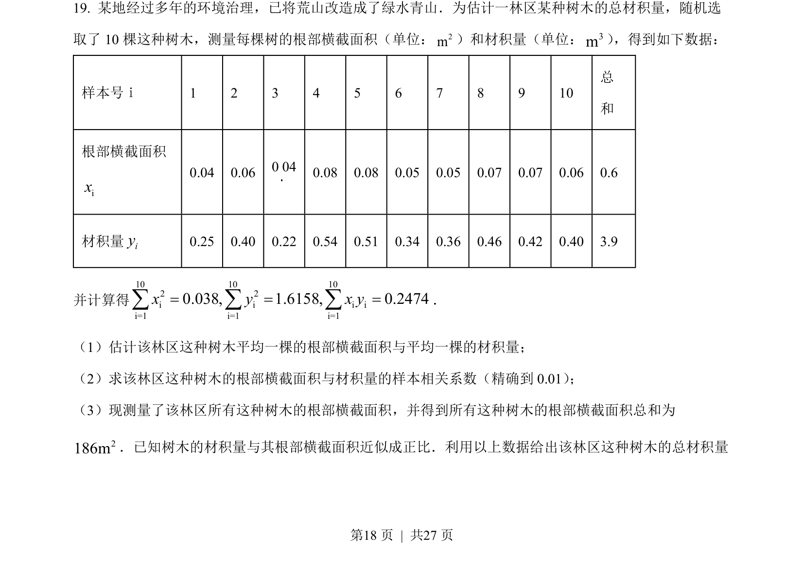
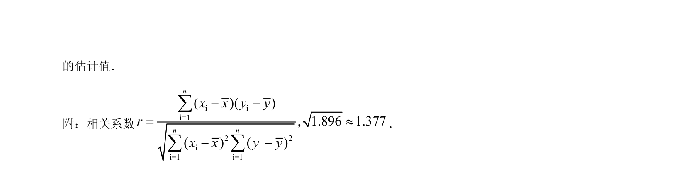
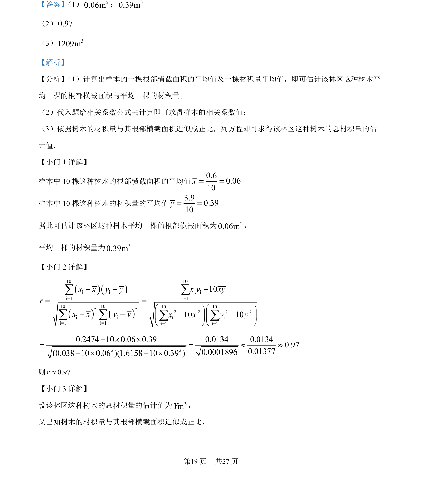
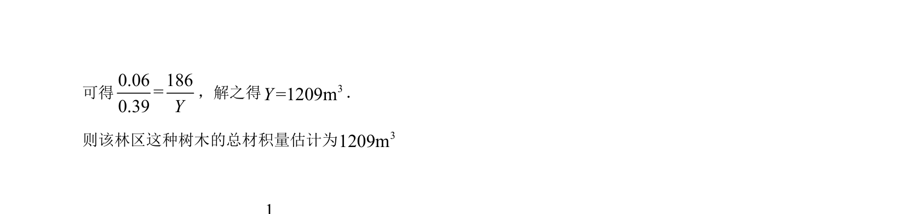

## 题面

## 摘要

林业抽样估计某林区树木总体材积，结合样本均值、相关系数与线性回归方程。

## 关联考点

- [[1098-统计抽样|统计抽样]]
- [[055-平均数|样本平均数]]
- [[359-统计案例|相关系数]]
- [[481-回归直线方程|线性回归方程]]

## 答案与解析

> 📄 原 PDF 第 18 页：`素材/真题/吉林/2008-2024·（吉林）数学高考真题/2022年高考数学试卷（文）（全国乙卷）（解析卷）.pdf`
