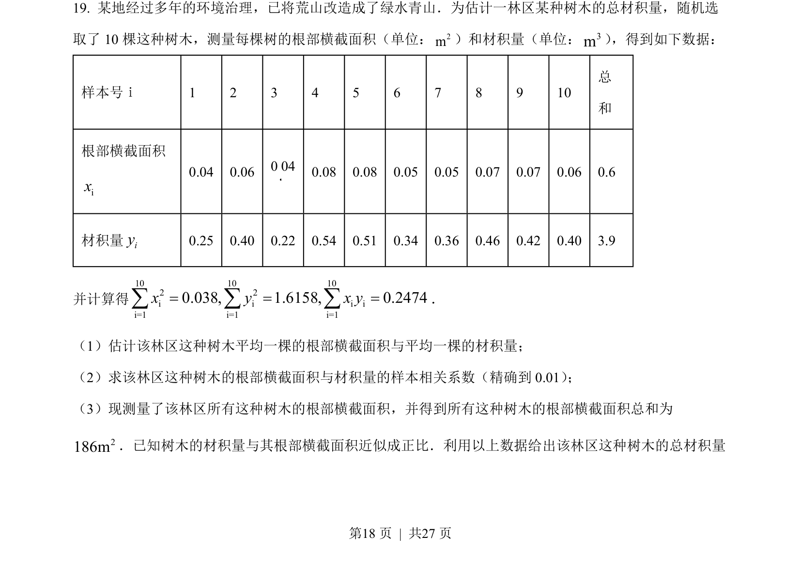
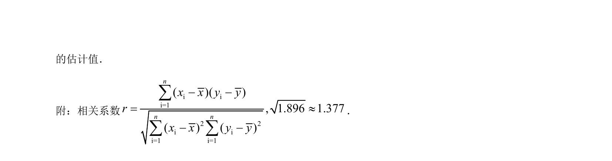
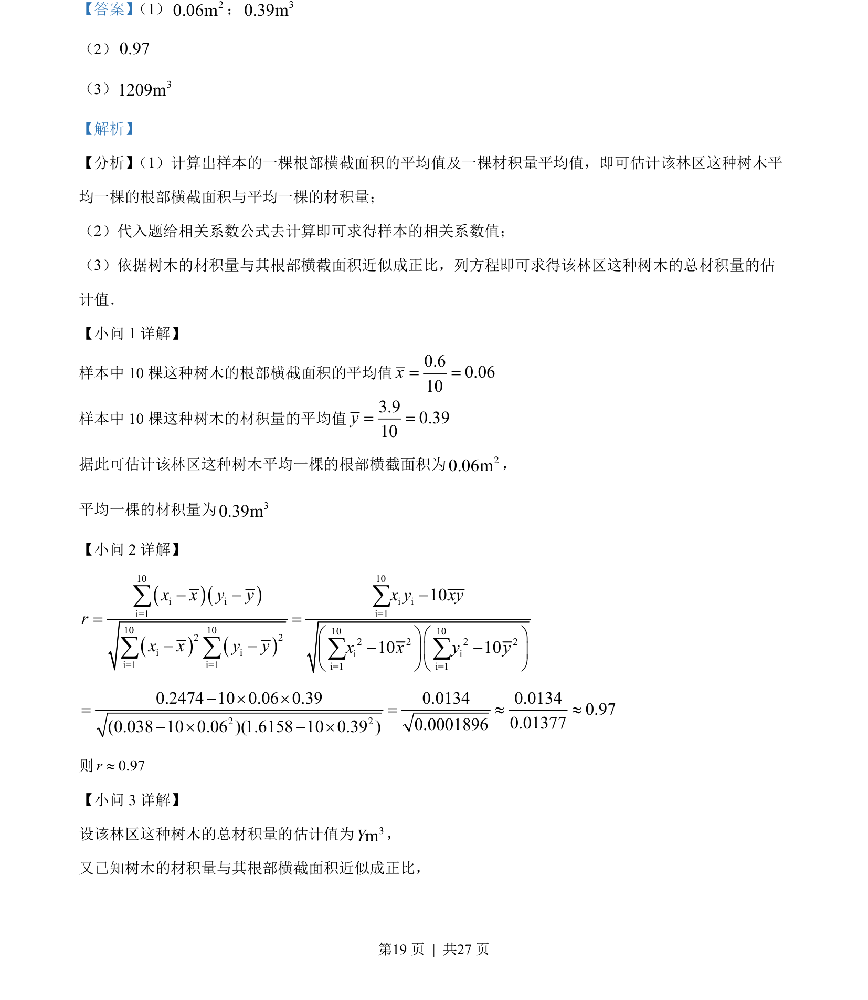
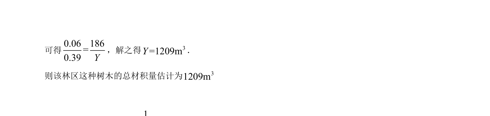

## 题面

## 摘要

林业抽样估计某林区树木总体材积，结合样本均值、相关系数与线性回归方程。

## 关联考点

- [[1097-统计抽样|统计抽样]]
- [[055-平均数|样本平均数]]
- [[359-统计案例|相关系数]]
- [[481-回归直线方程|线性回归方程]]

## 答案与解析

> 📄 原 PDF 第 18 页：`素材/真题/吉林/2008-2024·（吉林）数学高考真题/2022年高考数学试卷（文）（全国乙卷）（解析卷）.pdf`

<!-- 题干文本-start -->
## 题干文本
19. 某地经过多年的环境治理，已将荒山改造成了绿水青山．为估计一林区某种树木的总材积量，随机选
取了 10 棵这种树木，测量每棵树的根部横截面积（单位：2m）和材积量（单位：3m） ，得到如下数据：
样本号ｉ 1 2 3 4 5 6 7 8 9 10
总
和
根部横截面积
ix
0.04 0.06 0 04 0.08 0.08 0.05 0.05 0.07 0.07 0.06 0.6
材积量iy0.25 0.40 0.22 0.54 0.51 0.34 0.36 0.46 0.42 0.40 3.9
并计算得
10 10 102 2i i i ii=1 i=1 i=10.038, 1.6158, 0.2474x y x y= = =å å å．
（1）估计该林区这种树木平均一棵的根部横截面积与平均一棵的材积量；
（2）求该林区这种树木的根部横截面积与材积量的样本相关系数（精确到 0.01） ；
（3）现测量了该林区所有这种树木的根部横截面积，并得到所有这种树木的根部横截面积总和为
2186m．已知树木的材积量与其根部横截面积近似成正比．利用以上数据给出该林区这种树木的总材积量
.
<!-- 题干文本-end -->

<!-- 解析文本-start -->
## 解析文本

<!-- 解析文本-end -->
