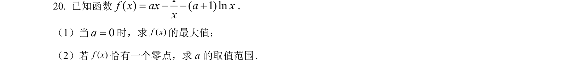
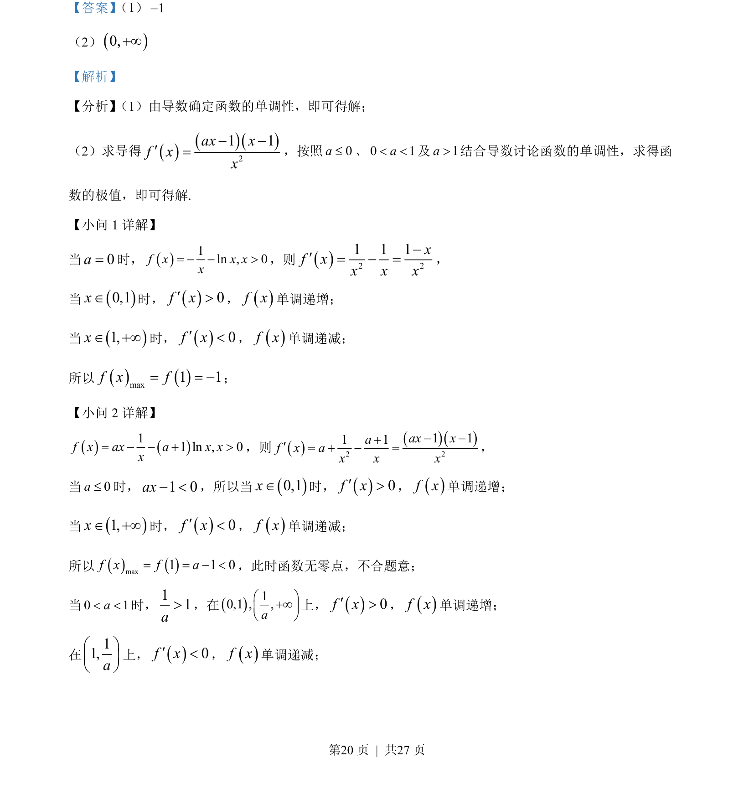

## 题面

## 摘要

本题通过求导讨论含参数函数的单调性与极值，重点考查分类讨论思想的应用。

## 关联考点

- [[导数应用]]
- [[函数单调性]]
- [[286-函数的最值|极值]]
- [[424-参数分类讨论|分类讨论]]

## 答案与解析

> 📄 原 PDF 第 20 页：`素材/真题/吉林/2008-2024·（吉林）数学高考真题/2022年高考数学试卷（文）（全国乙卷）（解析卷）.pdf`
