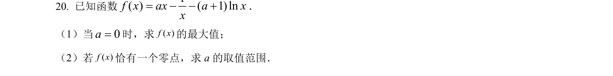
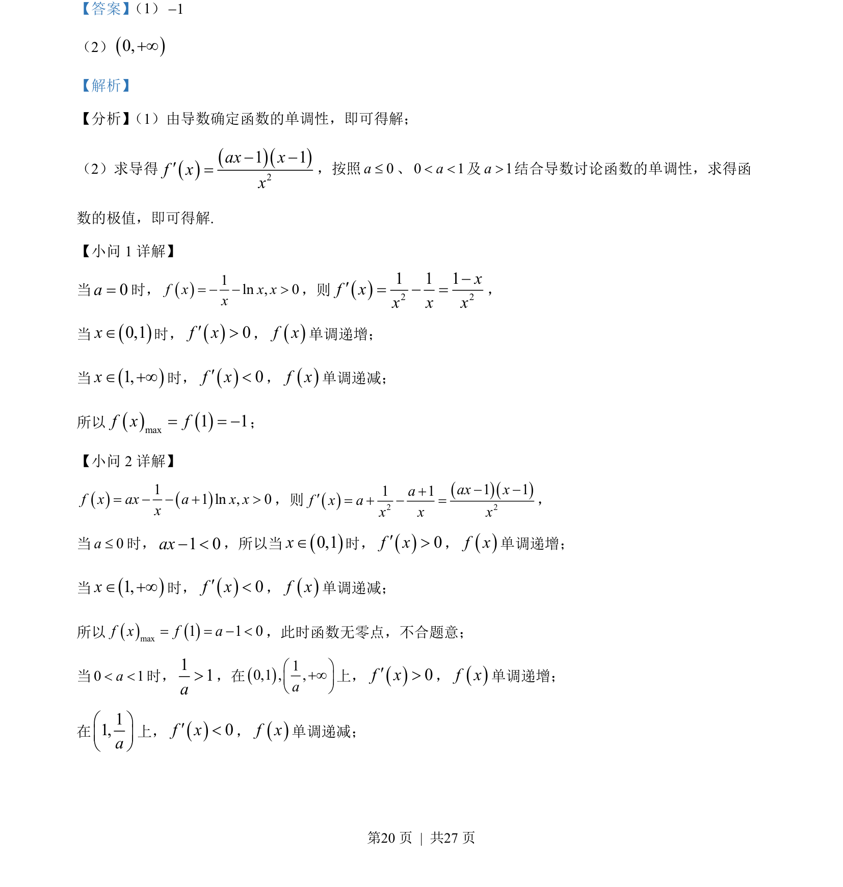
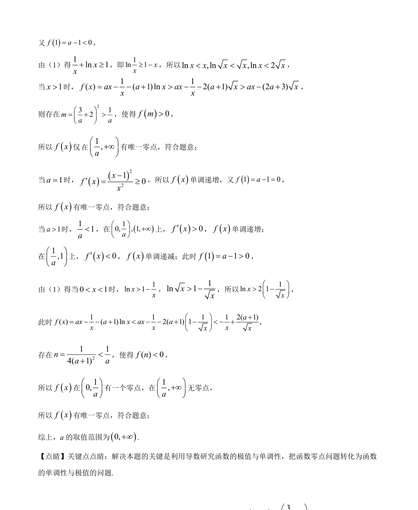

## 题面

## 摘要

本题通过求导讨论含参数函数的单调性与极值，重点考查分类讨论思想的应用。

## 关联考点

- [[436-导数应用-几何最值|导数应用]]
- [[432-导数与函数单调性|函数单调性]]
- [[286-函数的最值|极值]]
- [[424-参数分类讨论|分类讨论]]

## 答案与解析

> 📄 原 PDF 第 20 页：`素材/真题/吉林/2008-2024·（吉林）数学高考真题/2022年高考数学试卷（文）（全国乙卷）（解析卷）.pdf`

<!-- 题干文本-start -->
## 题干文本
20. 已知函数 1( ) ( 1) lnf x ax a xx= - - +．
（1）当0a=时，求( )f x的最大值；
（2）若( )f x恰有一个零点，求 a 的取值范围．
<!-- 题干文本-end -->

<!-- 解析文本-start -->
## 解析文本
【答案】 （1）1-    
（2）0,+¥
【解析】
【分析】 （1）由导数确定函数的单调性，即可得解；
（2）求导得21 1ax xf xx- -¢=，按照0a£、0 1a< <及1a>结合导数讨论函数的单调性，求得函
数的极值，即可得解.
【小问 1 详解】
当0a=时，1ln , 0f x x xx= - - >，则2 21 1 1xf xx x x-¢= - =，
当0,1xÎ时，0f x¢>，f x单调递增；
当1,xÎ +¥时，0f x¢<，f x单调递减；
所以max1 1f x f= = -；
【小问 2 详解】
11 ln , 0f x ax a x xx= - - + >，则2 21 11 1ax xaf x ax x x- -+¢= + - =，
当0a£时，1 0ax- <，所以当0,1xÎ时，0f x¢>，f x单调递增；
当1,xÎ +¥时，0f x¢<，f x单调递减；
所以max1 1 0f x f a= = - <，此时函数无零点，不合题意；
当0 1a< <时，11a>，在10,1 , ,aæ ö+¥ç ÷è ø上，0f x¢>，f x单调递增；
在11,aæ öç ÷è ø
上，0f x¢<，f x单调递减；
<!-- 解析文本-end -->
