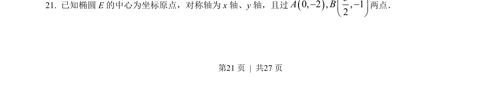
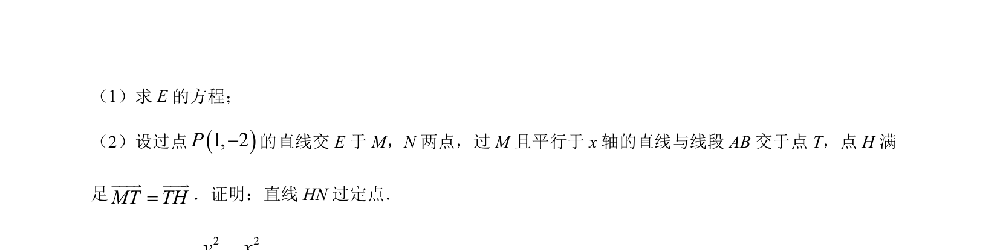
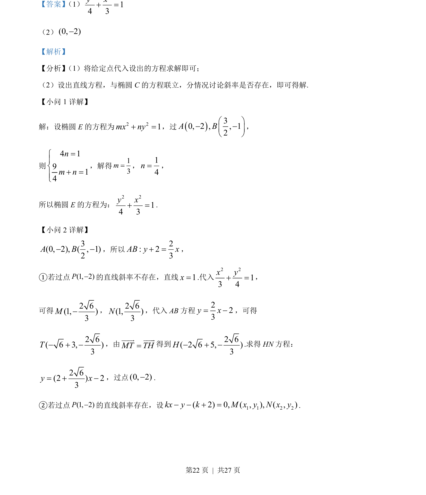
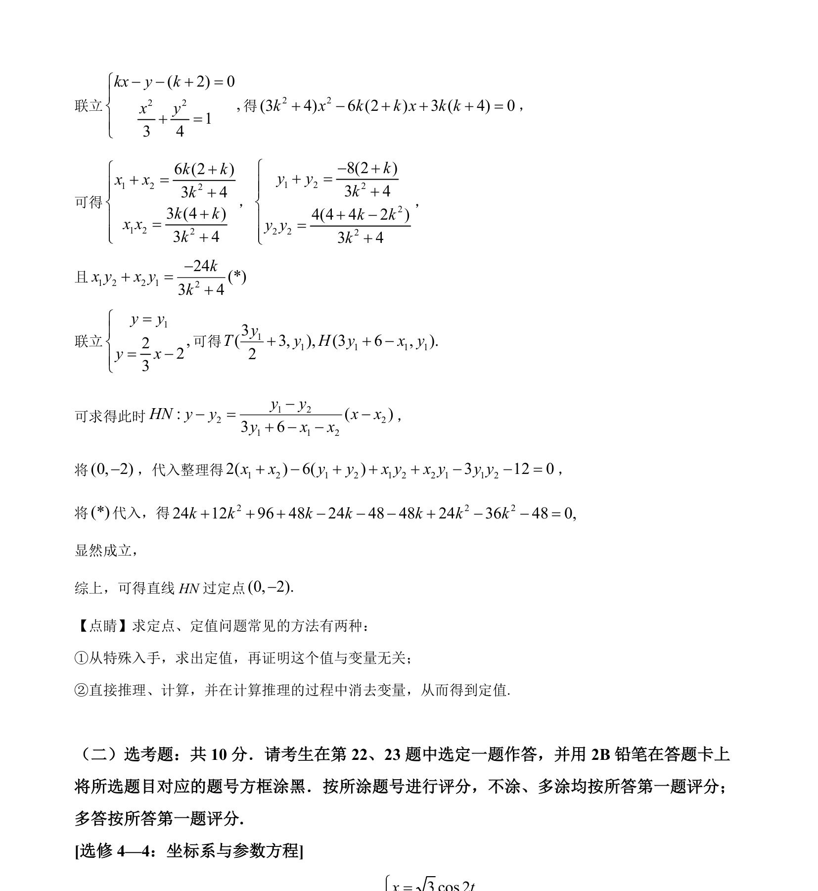

## 题面

## 摘要

考查椭圆标准方程的求解以及直线与椭圆相交的综合问题。

## 关联考点

- [[061-方程|椭圆的标准方程]]
- [[015-位置|直线与椭圆的位置关系]]
- [[1183-分类讨论思想|分类讨论思想]]

## 答案与解析

> 📄 原 PDF 第 21 页：`素材/真题/吉林/2008-2024·（吉林）数学高考真题/2022年高考数学试卷（文）（全国乙卷）（解析卷）.pdf`
