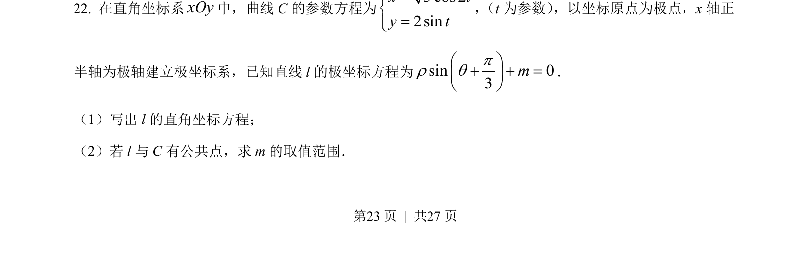
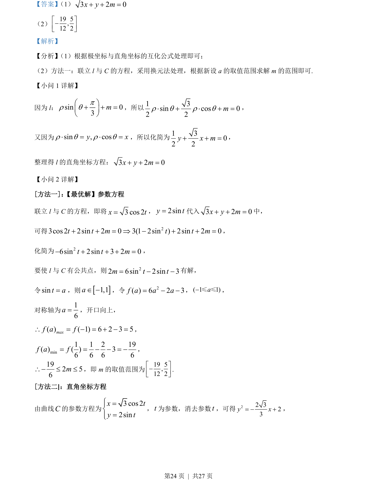
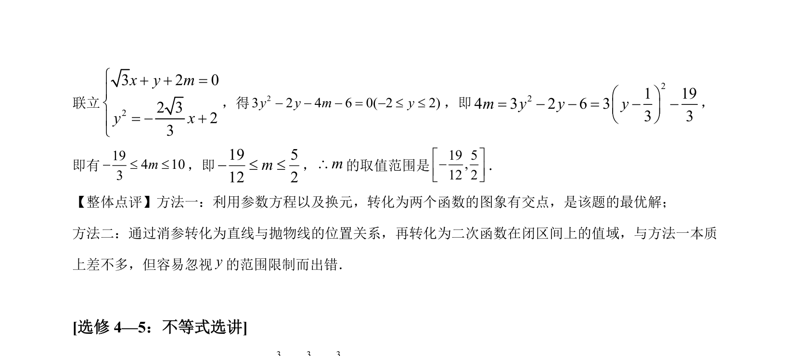

## 题面

## 摘要

本题考查极坐标方程转化为直角坐标方程，并利用参数方程求参数的取值范围。

## 关联考点

- [[920-极坐标与直角坐标互化|极坐标与直角坐标互化]]
- [[061-方程|参数方程]]
- [[640-二次函数最值|二次函数最值]]

## 答案与解析

> 📄 原 PDF 第 23 页：`素材/真题/吉林/2008-2024·（吉林）数学高考真题/2022年高考数学试卷（文）（全国乙卷）（解析卷）.pdf`

<!-- 题干文本-start -->
## 题干文本
22. 在直角坐标系xOy中，曲线 C的参数方程为3 cos 22sinx ty tì=ïí=ïî
， （t为参数） ，以坐标原点为极点，x轴正
半轴为极轴建立极坐标系，已知直线 l的极坐标方程为sin 03mpr qæ öç ÷è+ø+ =．
（1）写出 l的直角坐标方程；
（2）若 l与 C有公共点，求 m 的取值范围．
<!-- 题干文本-end -->

<!-- 解析文本-start -->
## 解析文本

<!-- 解析文本-end -->
