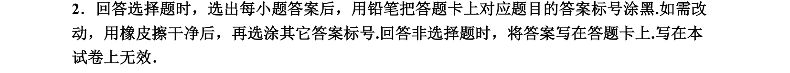
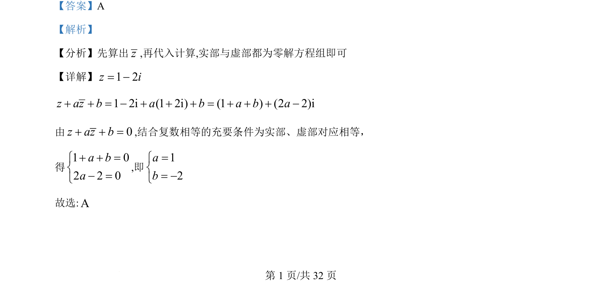

## 题面

## 摘要

本题通过已知复数及其共轭，利用复数相等条件求解实参数

## 关联考点

- [[811-复数运算|复数运算]]
- [[534-共轭复数|共轭复数]]
- [[810-复数相等的充要条件|复数相等的充要条件]]

## 答案与解析

> 📄 原 PDF 第 1 页：`素材/真题/吉林/2008-2024·（吉林）数学高考真题/2022年高考数学试卷（理）（全国乙卷）（解析卷）.pdf`

<!-- 题干文本-start -->
## 题干文本
2. 已知1 2z i= -，且 0z az b+ + =，其中 a，b 为实数，则（    ）
A. 1, 2a b= = -B. 1, 2a b= - =C. 1, 2a b= =D. 1, 2a b= - = -
<!-- 题干文本-end -->

<!-- 解析文本-start -->
## 解析文本
【答案】A
【解析】
【分析】先算出z,再代入计算,实部与虚部都为零解方程组即可
【详解】1 2z i= -1 2i (1 2i) (1 ) (2 2)iz az b a b a b a+ + = - + + + = + + + -
由 0z az b+ + =,结合复数相等的充要条件为实部、虚部对应相等，
得
1 02 2 0a ba+ + =ìí- =î
,即
12ab=ìí= -î
故选:A
<!-- 解析文本-end -->
