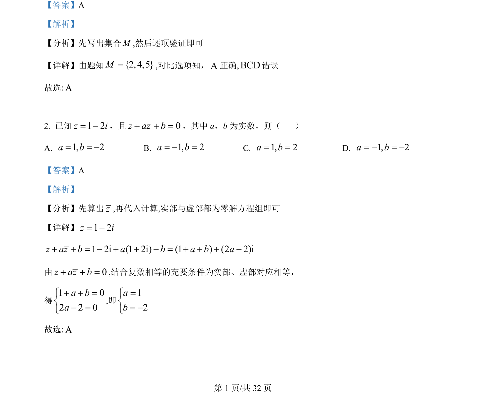

## 题面

## 摘要

根据向量模长关系，利用数量积运算求解两向量的数量积。

## 关联考点

- [[752-向量模长|向量的模]]
- [[328-向量的数量积|向量的数量积]]

## 答案与解析

> 📄 原 PDF 第 2 页：`素材/真题/吉林/2008-2024·（吉林）数学高考真题/2022年高考数学试卷（理）（全国乙卷）（解析卷）.pdf`

<!-- 题干文本-start -->
## 题干文本
3. 已知向量,a br r
满足| | 1,| | 3,| 2 | 3a b a b= = - =r r r r
，则a b× =r r
（    ）
A. 2-B. 1-C. 1 D. 2
<!-- 题干文本-end -->

<!-- 解析文本-start -->
## 解析文本
【答案】C
【解析】
【分析】根据给定模长，利用向量的数量积运算求解即可.
【详解】解：∵
22 2| 2 | | | 4 4- = - × +r r rr r ra b a a b b，
又∵| | 1,| | 3,| 2 | 3,= = - =r rr ra b a b
∴91 4 4 3 13 4= - × + ´ = - ×r rr ra b a b，
∴1a b× =rr
故选：C.
<!-- 解析文本-end -->
