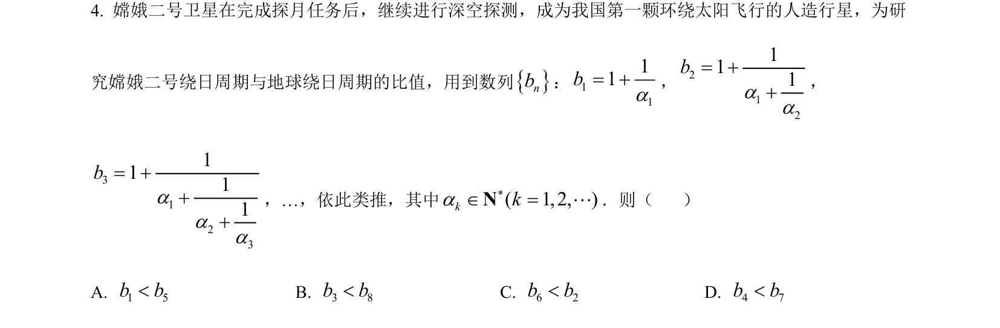
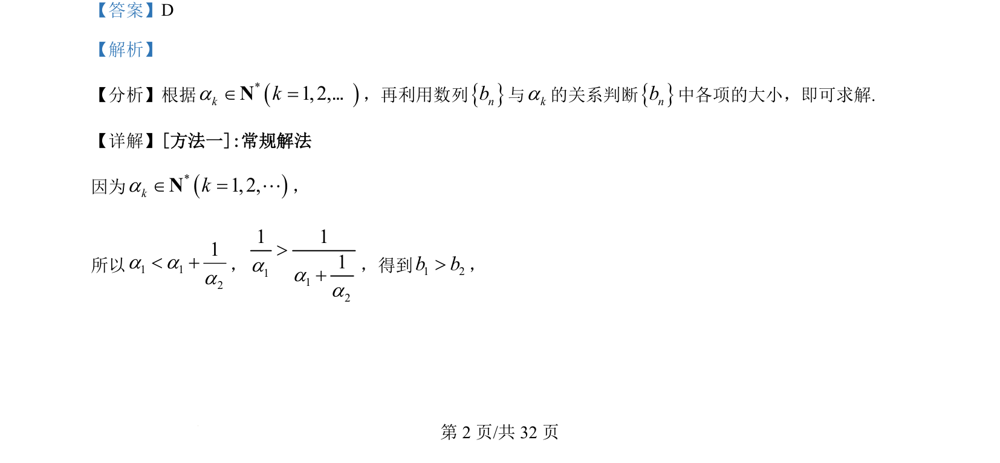
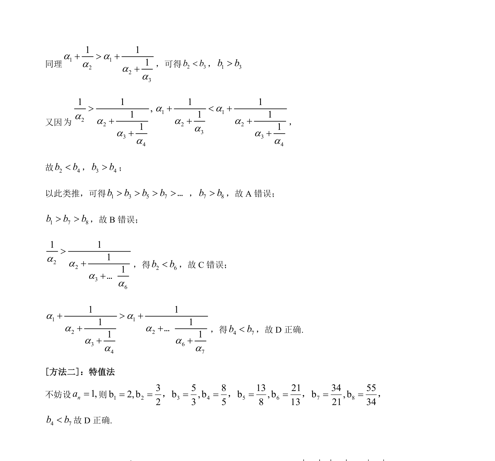

## 题面

## 摘要

本题通过数列递推关系比较各项大小，考查逻辑推理与特值验证能力。

## 关联考点

- [[455-数列单调性|数列单调性]]
- [[622-不等式比较|不等式比较]]
- [[383-数列递推公式|递推关系]]
- [[982-特值法|特值法]]

## 答案与解析

> 📄 原 PDF 第 2 页：`素材/真题/吉林/2008-2024·（吉林）数学高考真题/2022年高考数学试卷（理）（全国乙卷）（解析卷）.pdf`
