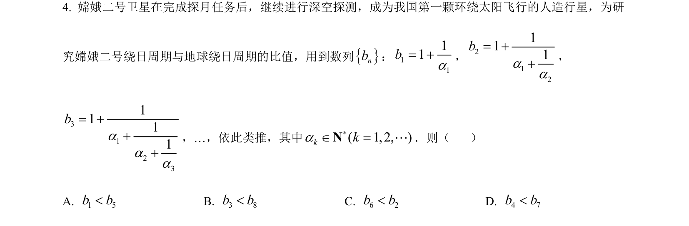
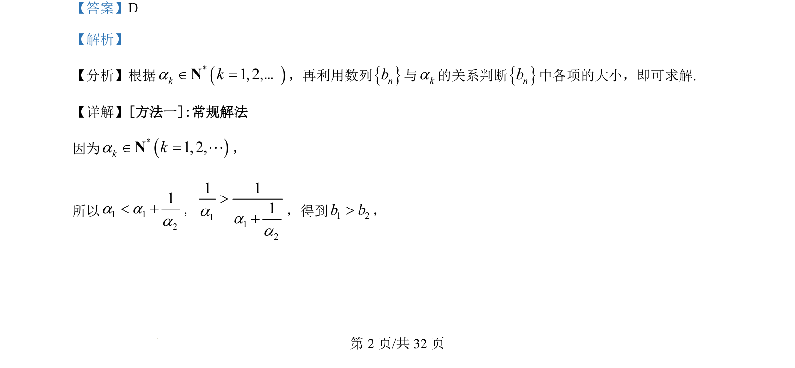
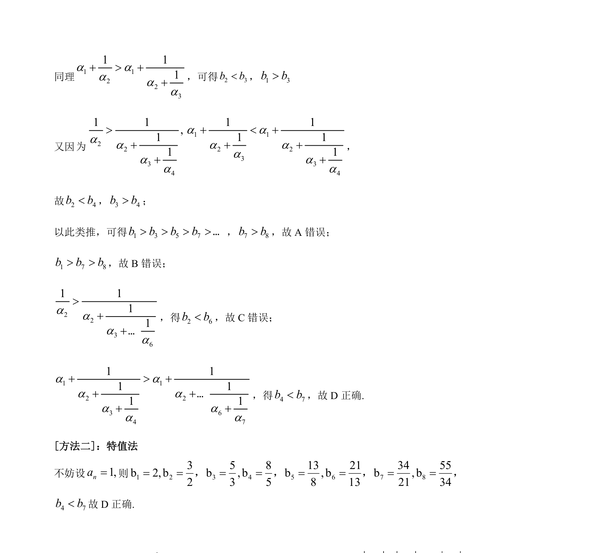

## 题面

## 摘要

本题通过数列递推关系比较各项大小，考查逻辑推理与特值验证能力。

## 关联考点

- [[455-数列单调性|数列单调性]]
- [[622-不等式比较|不等式比较]]
- [[383-数列递推公式|递推关系]]
- [[982-特值法|特值法]]

## 答案与解析

> 📄 原 PDF 第 2 页：`素材/真题/吉林/2008-2024·（吉林）数学高考真题/2022年高考数学试卷（理）（全国乙卷）（解析卷）.pdf`

<!-- 题干文本-start -->
## 题干文本
4. 嫦娥二号卫星在完成探月任务后，继续进行深空探测，成为我国第一颗环绕太阳飞行的人造行星，为研
究嫦娥二号绕日周期与地球绕日周期的比值，用到数列{}nb：1111ba= +，212111baa= ++，
31231111baaa= +++
，…，依此类推，其中( 1,2, )kka*Î =NL．则（    ）
A. 1 5b b<B. 3 8b b<C. 6 2b b<D. 4 7b b<
<!-- 题干文本-end -->

<!-- 解析文本-start -->
## 解析文本
【答案】D
【解析】
【分析】根据()*1, 2,kkaÎ =N…，再利用数列{}nb与ka的关系判断{}nb中各项的大小，即可求解.
【详解】[方法一]:常规解法
因为()*1, 2,kkaÎ =NL，
所以1 121a aa<+，1121 11aaa>+，得到1 2b b>，
<!-- 解析文本-end -->
