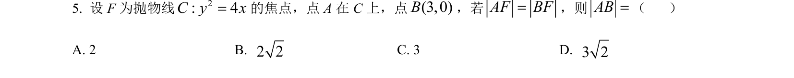
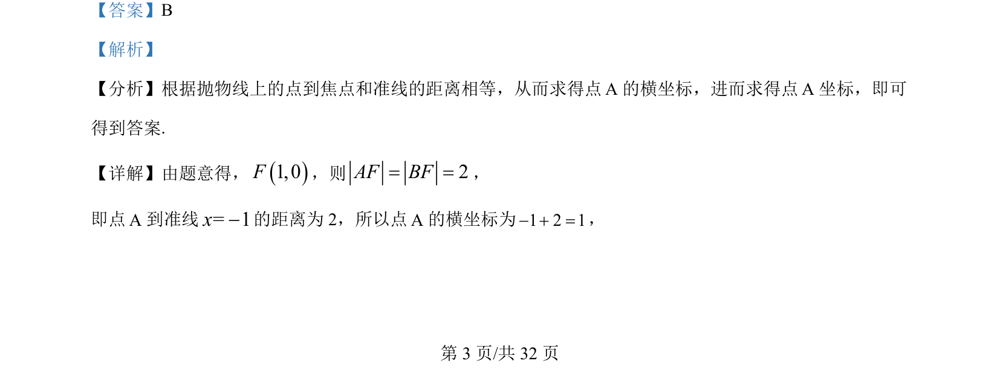
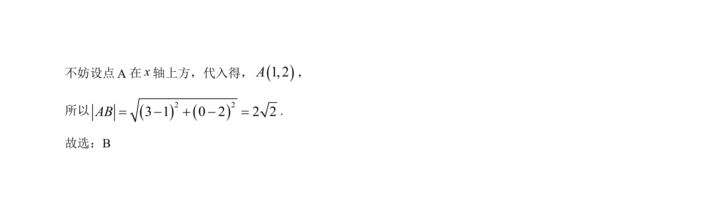

## 题面

## 摘要

根据抛物线定义求点坐标，再利用两点距离公式求弦长。

## 关联考点

- [[227-抛物线|抛物线定义]]
- [[626-两点间距离公式|两点间距离公式]]

## 答案与解析

> 📄 原 PDF 第 3 页：`素材/真题/吉林/2008-2024·（吉林）数学高考真题/2022年高考数学试卷（理）（全国乙卷）（解析卷）.pdf`

<!-- 题干文本-start -->
## 题干文本
5. 设 F为抛物线2: 4C y x=的焦点，点 A在 C上，点(3,0)B，若AF BF=，则AB=（    ）
A. 2 B. 2 2C. 3 D. 3 2
<!-- 题干文本-end -->

<!-- 解析文本-start -->
## 解析文本
【答案】B
【解析】
【分析】根据抛物线上的点到焦点和准线的距离相等，从而求得点A的横坐标，进而求得点A坐标，即可
得到答案.
【详解】由题意得，()1,0F，则 2AF BF= =，
即点A到准线= 1x-的距离为 2，所以点A的横坐标为1 2 1- + =，
为
<!-- 解析文本-end -->
