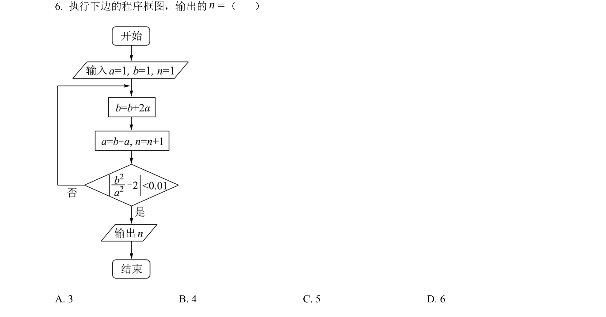
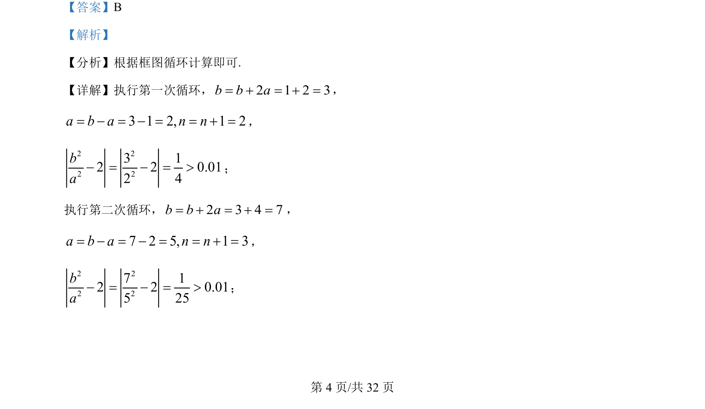
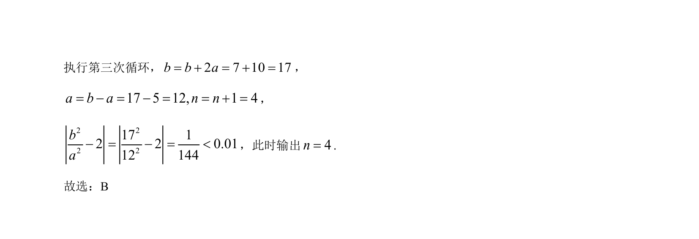

## 题面

## 摘要

该题考查程序框图中循环结构的执行与条件判断，通过模拟计算输出循环次数。

## 关联考点

- [[1076-算法与框图|算法与框图]]
- [[870-循环结构|循环结构]]
- [[916-条件判断|条件判断]]

## 答案与解析

> 📄 原 PDF 第 4 页：`素材/真题/吉林/2008-2024·（吉林）数学高考真题/2022年高考数学试卷（理）（全国乙卷）（解析卷）.pdf`
