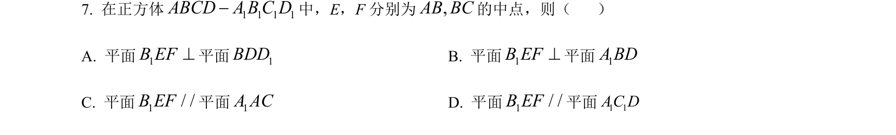
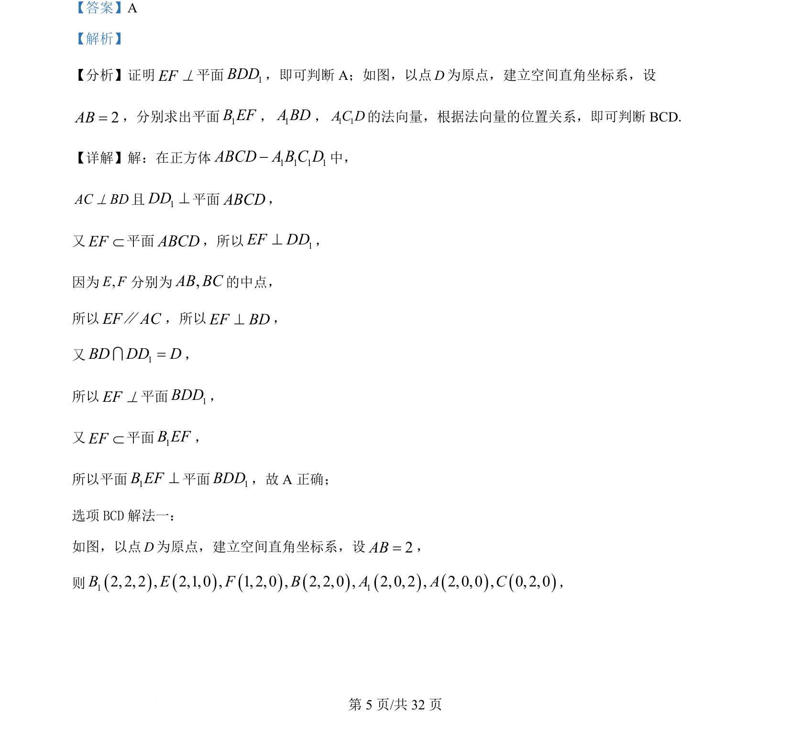

## 题面

## 摘要

在正方体中证明线面垂直和面面垂直，并利用空间直角坐标系和法向量判断平行与垂直关系。

## 关联考点

- [[351-空间直线平面垂直|线面垂直]]
- [[351-空间直线平面垂直|面面垂直]]
- [[399-空间向量坐标表示|空间直角坐标系]]
- [[411-空间平面法向量|法向量]]

## 答案与解析

> 📄 原 PDF 第 5 页：`素材/真题/吉林/2008-2024·（吉林）数学高考真题/2022年高考数学试卷（理）（全国乙卷）（解析卷）.pdf`
