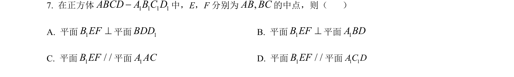
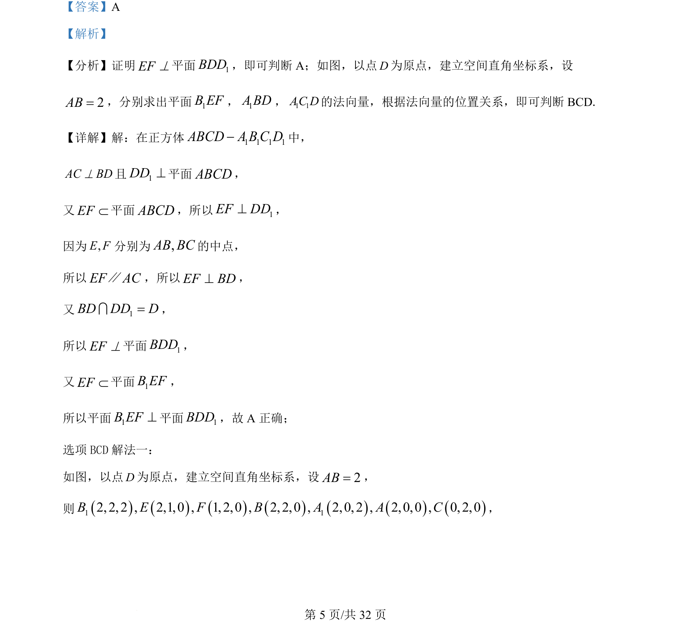
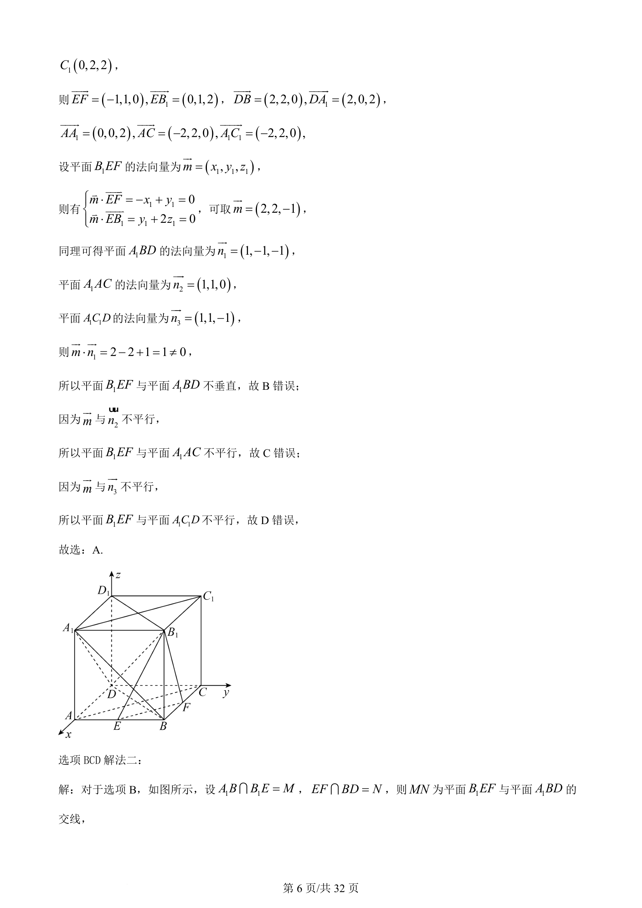
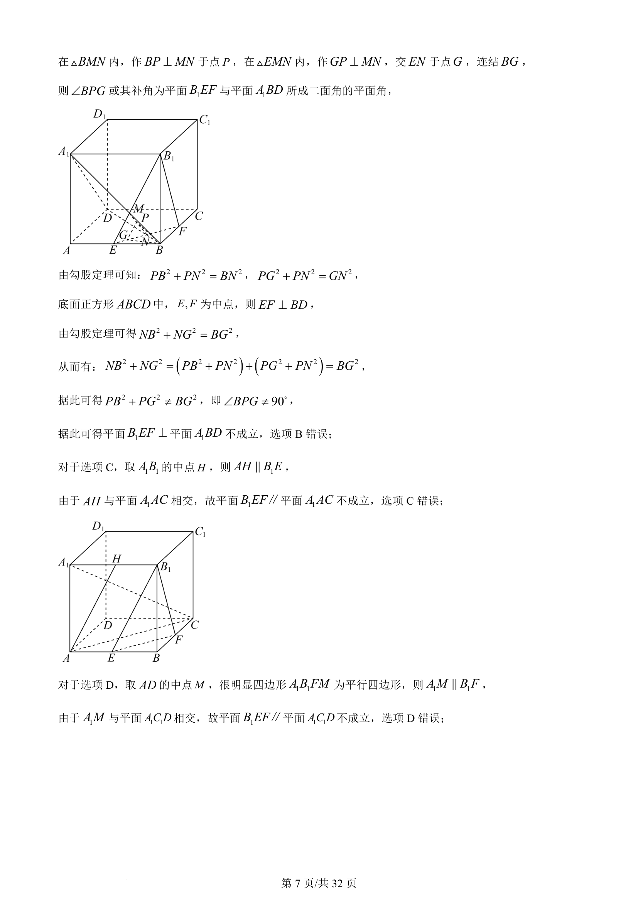
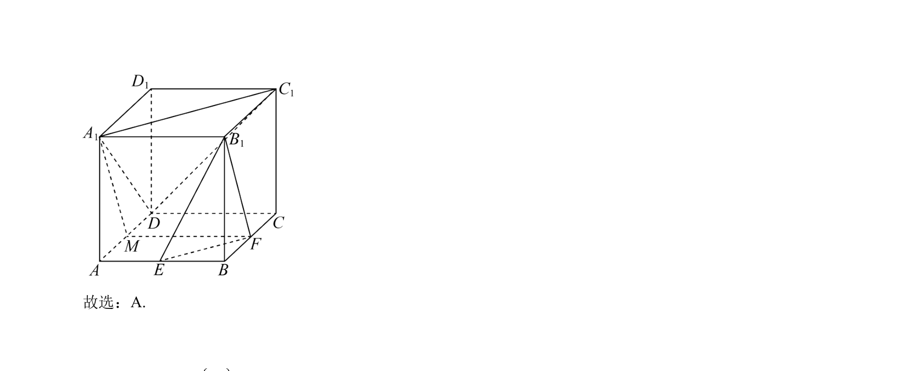

## 题面

## 摘要

正方体ABCD-A₁B₁C₁D₁中E、F分别为AB、BC中点，判断平面B₁EF与各平面的垂直或平行关系。

## 关联考点

- [[1055-立体几何|立体几何]]
- [[352-空间直线平面平行|线面平行]]
- [[351-空间直线平面垂直|面面垂直]]
- [[352-空间直线平面平行|面面平行]]

## 答案与解析

> 📄 原 PDF 第 5 页：`素材/真题/吉林/2008-2024·（吉林）数学高考真题/2022年高考数学试卷（理）（全国乙卷）（解析卷）.pdf`

<!-- 题干文本-start -->
## 题干文本
7. 在正方体 1 1 1 1ABCD A B C D-中，E，F分别为,AB BC的中点，则（    ）
A. 平面1B EF^平面1BDDB. 平面1B EF^平面1A BD
C. 平面1/ /B EF平面1A ACD. 平面1/ /B EF平面1 1AC D
<!-- 题干文本-end -->

<!-- 解析文本-start -->
## 解析文本
【答案】A
【解析】
【分析】证明EF^平面1BDD，即可判断 A；如图，以点D为原点，建立空间直角坐标系，设
2AB=，分别求出平面1B EF，1A BD，1 1AC D的法向量，根据法向量的位置关系，即可判断 BCD.
【详解】解：在正方体 1 1 1 1ABCD A B C D-中，
AC BD^且1DD^平面ABCD，
又EFÌ平面ABCD，所以 1EF DD^，
因为,E F分别为,AB BC的中点，
所以EF AC∥，所以EF BD^，
又 1BD DD D=I，
所以EF^平面1BDD，
又EFÌ平面1B EF，
所以平面1B EF^平面1BDD，故 A 正确；
选项BCD解法一：
如图，以点D为原点，建立空间直角坐标系，设2AB=，
则()()()()()()()1 12, 2, 2 , 2,1,0 , 1, 2,0 , 2, 2,0 , 2,0, 2 , 2,0,0 , 0, 2,0B E F B A A C，
<!-- 解析文本-end -->
