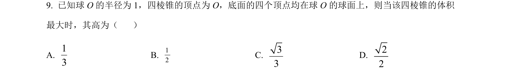
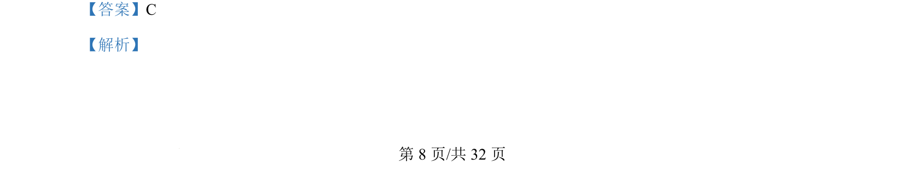
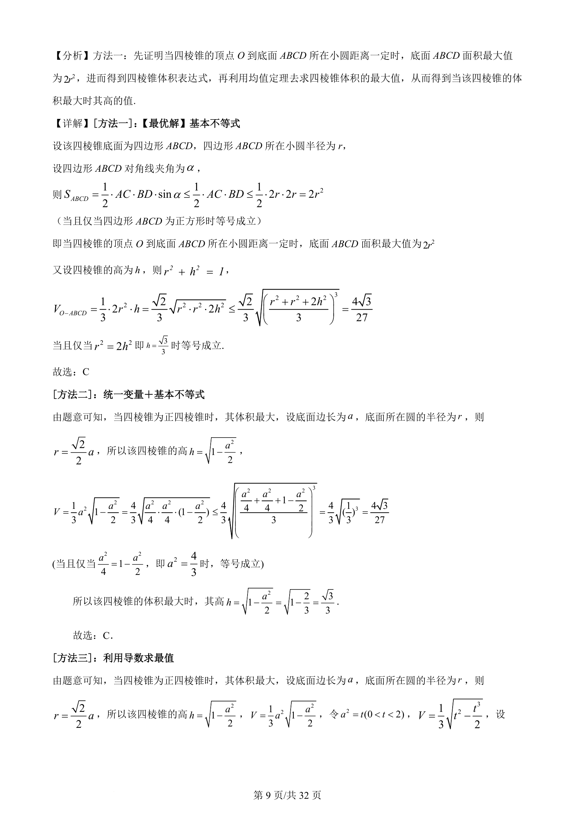
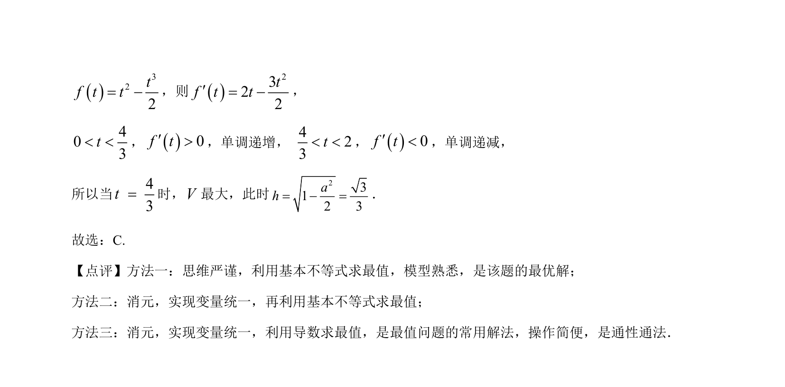

## 题面

## 摘要

本题通过建立四棱锥体积表达式，利用基本不等式求体积最大值及对应的高。

## 关联考点

- [[066-体积|四棱锥体积]]
- [[295-基本不等式|基本不等式]]
- [[最值问题]]

## 答案与解析

> 📄 原 PDF 第 8 页：`素材/真题/吉林/2008-2024·（吉林）数学高考真题/2022年高考数学试卷（理）（全国乙卷）（解析卷）.pdf`
