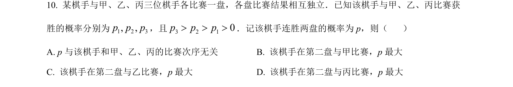
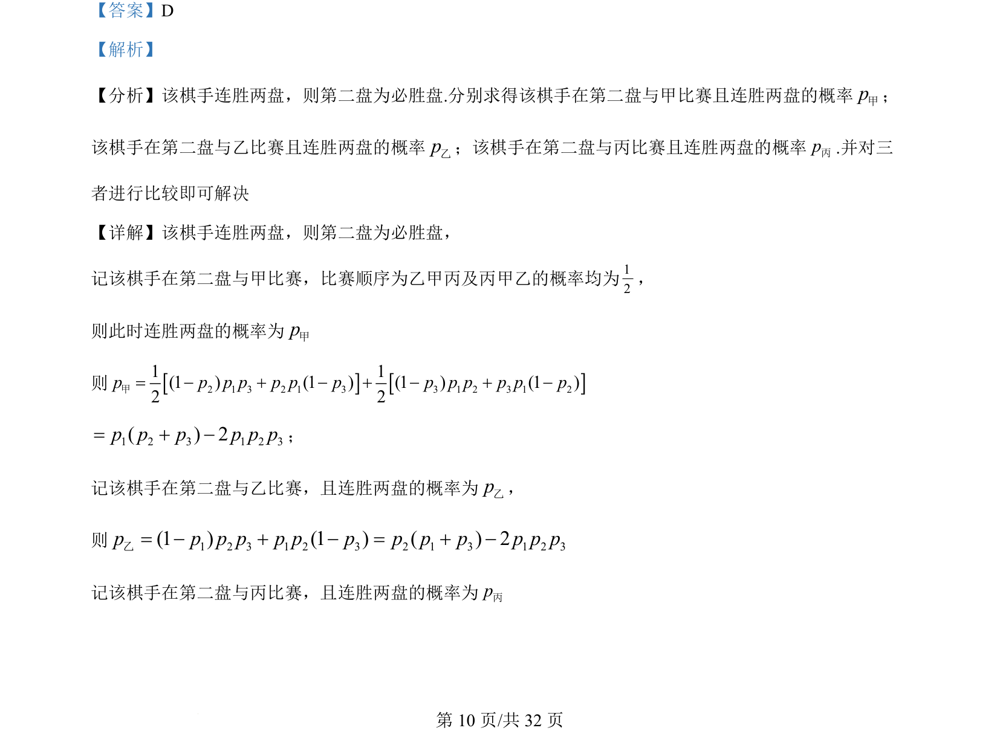
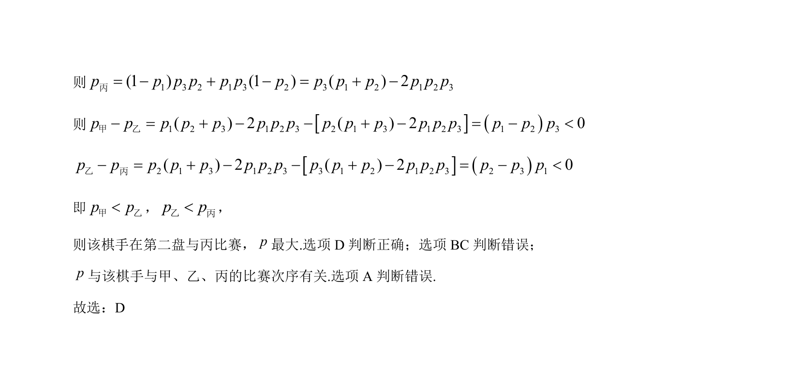

## 题面

## 摘要

本题通过计算棋手在不同对手组合下连胜两盘的概率，比较概率大小以确定最优比赛顺序。

## 关联考点

- [[948-概率计算|概率计算]]
- [[424-参数分类讨论|分类讨论]]
- [[889-数值比较|比较大小]]

## 答案与解析

> 📄 原 PDF 第 10 页：`素材/真题/吉林/2008-2024·（吉林）数学高考真题/2022年高考数学试卷（理）（全国乙卷）（解析卷）.pdf`
