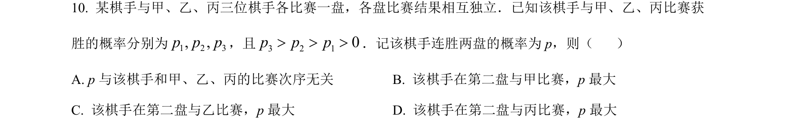
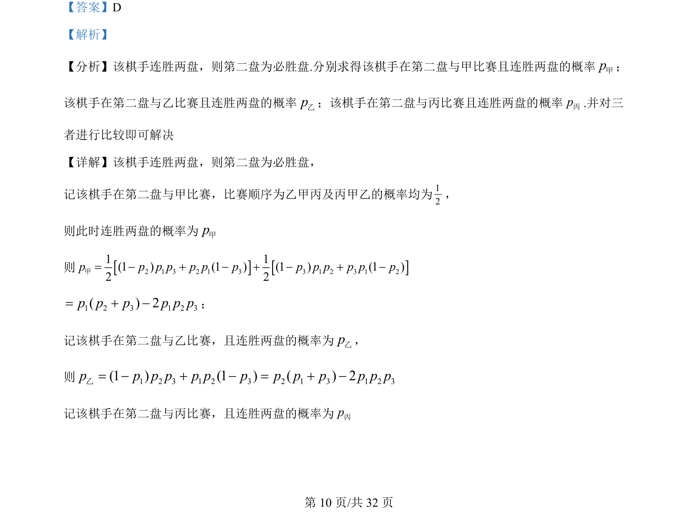
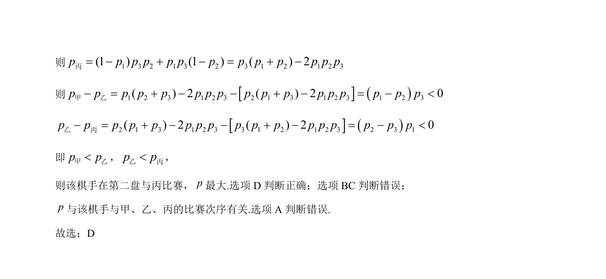

## 题面

## 摘要

本题通过计算棋手在不同对手组合下连胜两盘的概率，比较概率大小以确定最优比赛顺序。

## 关联考点

- [[948-概率计算|概率计算]]
- [[424-参数分类讨论|分类讨论]]
- [[889-数值比较|比较大小]]

## 答案与解析

> 📄 原 PDF 第 10 页：`素材/真题/吉林/2008-2024·（吉林）数学高考真题/2022年高考数学试卷（理）（全国乙卷）（解析卷）.pdf`

<!-- 题干文本-start -->
## 题干文本
10. 某棋手与甲、乙、丙三位棋手各比赛一盘，各盘比赛结果相互独立．已知该棋手与甲、乙、丙比赛获
胜的概率分别为1 2 3, ,p p p，且3 2 10p p p> > >．记该棋手连胜两盘的概率为 p，则（    ）
A. p 与该棋手和甲、乙、丙的比赛次序无关 B. 该棋手在第二盘与甲比赛，p 最大
C. 该棋手在第二盘与乙比赛，p 最大 D. 该棋手在第二盘与丙比赛，p 最大
<!-- 题干文本-end -->

<!-- 解析文本-start -->
## 解析文本
【答案】D
【解析】
【分析】该棋手连胜两盘，则第二盘为必胜盘.分别求得该棋手在第二盘与甲比赛且连胜两盘的概率p甲；
该棋手在第二盘与乙比赛且连胜两盘的概率p乙；该棋手在第二盘与丙比赛且连胜两盘的概率p丙.并对三
者进行比较即可解决
【详解】该棋手连胜两盘，则第二盘为必胜盘，
记该棋手在第二盘与甲比赛，比赛顺序为乙甲丙及丙甲乙的概率均为12，
则此时连胜两盘的概率为p甲
则2 1 3 2 1 3 3 1 2 3 1 21 1(1 ) (1 ) (1 ) (1 )2 2p p p p p p p p p p p p p= - + - + - + -甲1 2 3 1 2 3( ) 2p p p p p p= + -；
记该棋手在第二盘与乙比赛，且连胜两盘的概率为p乙，
则 1 2 3 1 2 3 2 1 3 1 2 3(1 ) (1 ) ( ) 2p p p p p p p p p p p p p= - + - = + -乙
记该棋手在第二盘与丙比赛，且连胜两盘的概率为p丙
<!-- 解析文本-end -->
