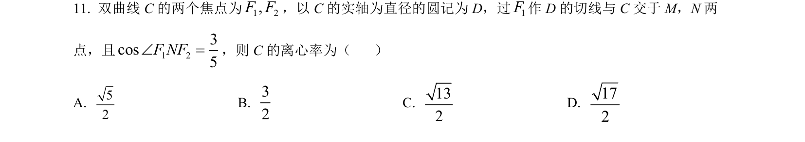
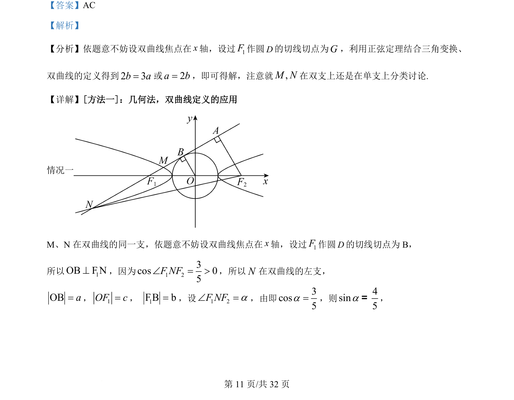
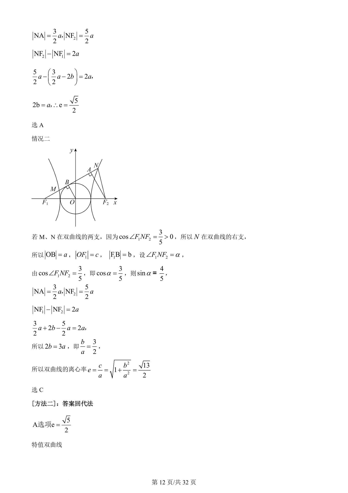
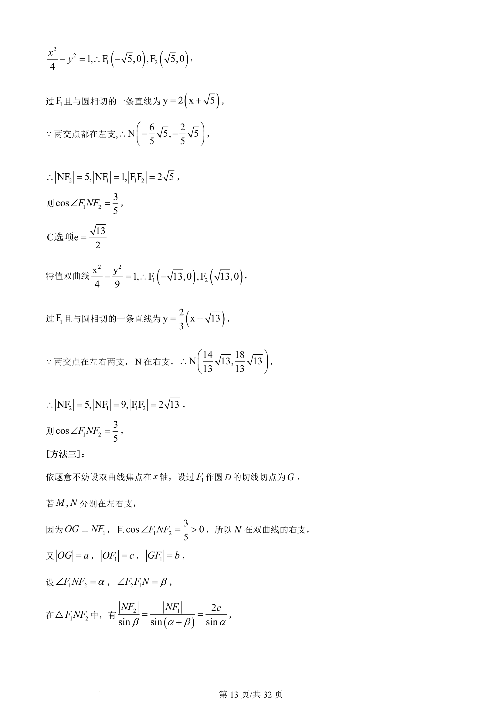
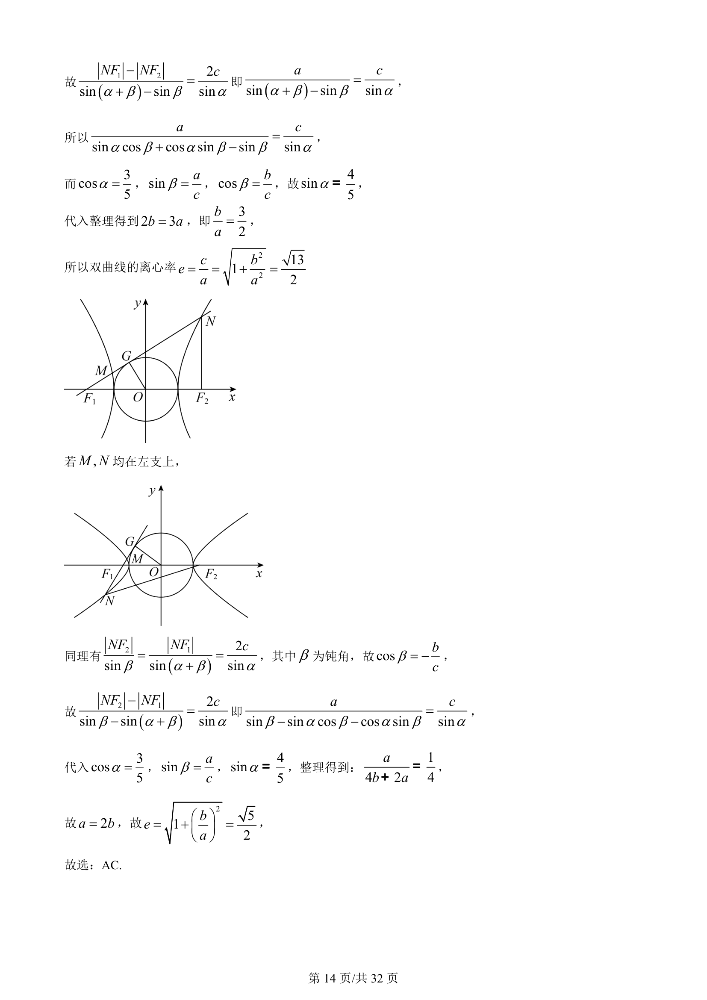

## 题面

## 摘要

本题考查双曲线离心率求解，通过焦点作圆切线并结合双曲线定义、几何关系，需对M、N位置分类讨论。

## 关联考点

- [[728-双曲线定义|双曲线定义]]
- [[391-椭圆离心率|离心率]]
- [[1005-直线与圆相切|直线与圆相切]]
- [[424-参数分类讨论|分类讨论]]

## 答案与解析

> 📄 原 PDF 第 11 页：`素材/真题/吉林/2008-2024·（吉林）数学高考真题/2022年高考数学试卷（理）（全国乙卷）（解析卷）.pdf`
