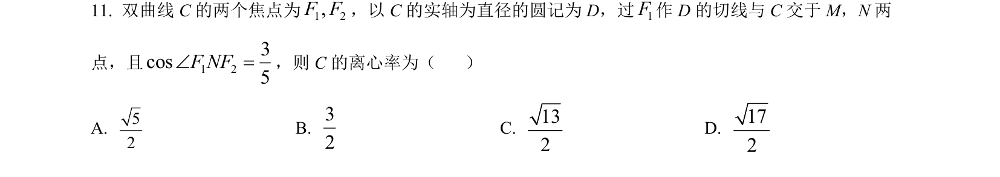
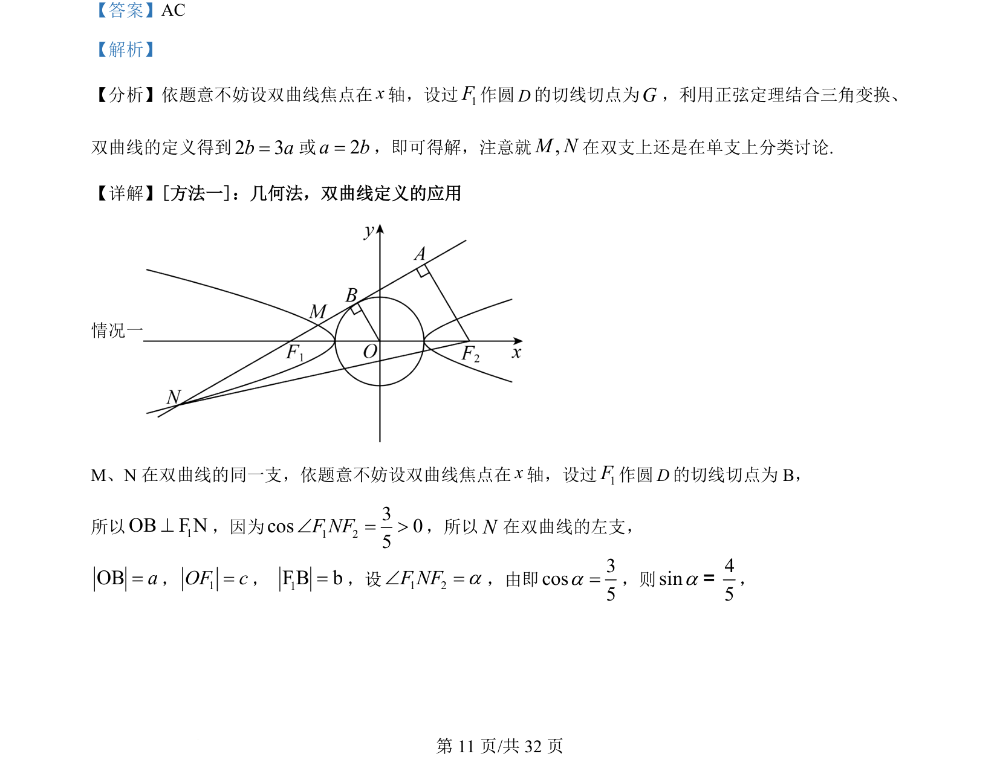
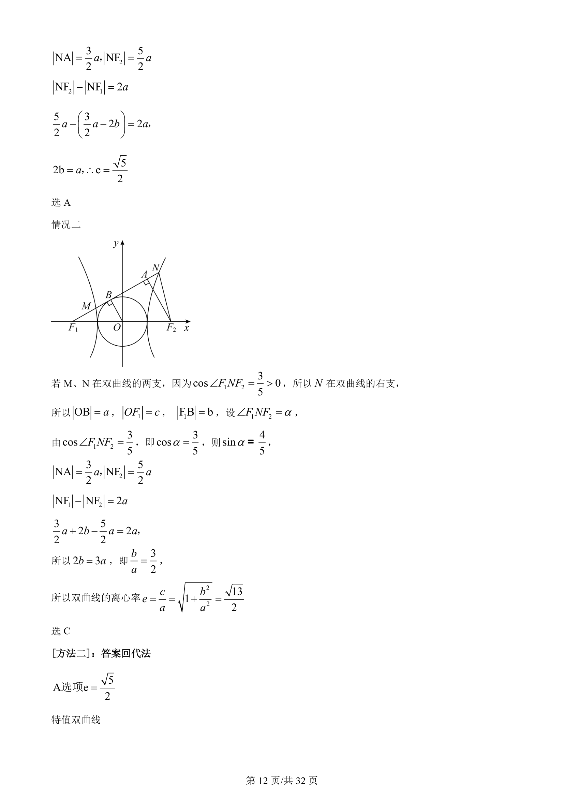
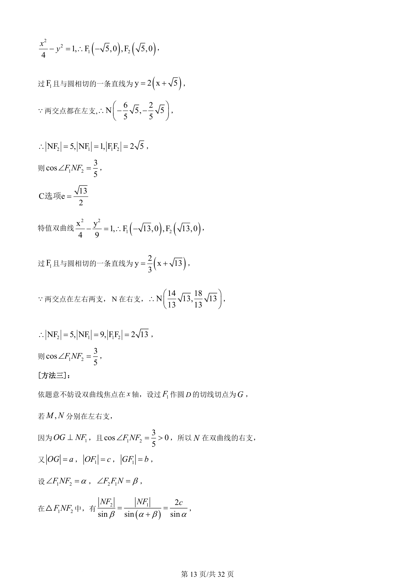
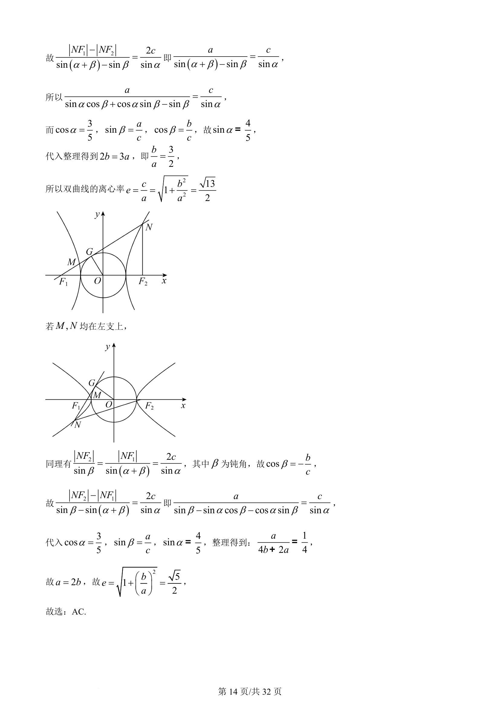

## 题面

## 摘要

本题考查双曲线离心率求解，通过焦点作圆切线并结合双曲线定义、几何关系，需对M、N位置分类讨论。

## 关联考点

- [[730-双曲线的定义|双曲线定义]]
- [[391-椭圆离心率|离心率]]
- [[1004-直线与圆相切|直线与圆相切]]
- [[424-参数分类讨论|分类讨论]]

## 答案与解析

> 📄 原 PDF 第 11 页：`素材/真题/吉林/2008-2024·（吉林）数学高考真题/2022年高考数学试卷（理）（全国乙卷）（解析卷）.pdf`

<!-- 题干文本-start -->
## 题干文本
11. 双曲线 C的两个焦点为1 2,F F，以 C的实轴为直径的圆记为 D，过1F作 D 的切线与 C交于 M，N两
点，且 1 23cos5F NFÐ =，则 C的离心率为（    ）
A. 52
B. 32
C. 132
D. 172
<!-- 题干文本-end -->

<!-- 解析文本-start -->
## 解析文本
【答案】AC
【解析】
【分析】依题意不妨设双曲线焦点在x轴，设过1F作圆D的切线切点为G，利用正弦定理结合三角变换、
双曲线的定义得到2 3b a=或2a b=，即可得解，注意就,M N在双支上还是在单支上分类讨论.
【详解】[方法一]：几何法，双曲线定义的应用
情况一  
M、N 在双曲线的同一支，依题意不妨设双曲线焦点在x轴，设过1F作圆D的切线切点为 B，
所以 1OB F N^，因为 1 23cos 05F NFÐ = >，所以N在双曲线的左支，
OBa=，1OF c=， 1F B b=，设1 2F NFaÐ =，由即3cos5a=，则4sin5a=，
<!-- 解析文本-end -->
