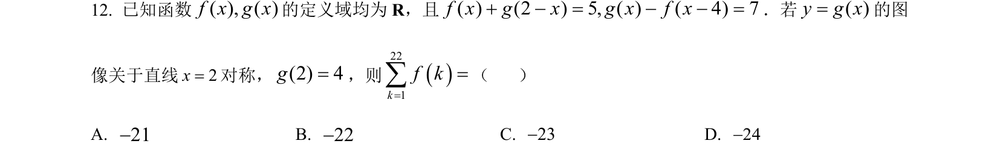
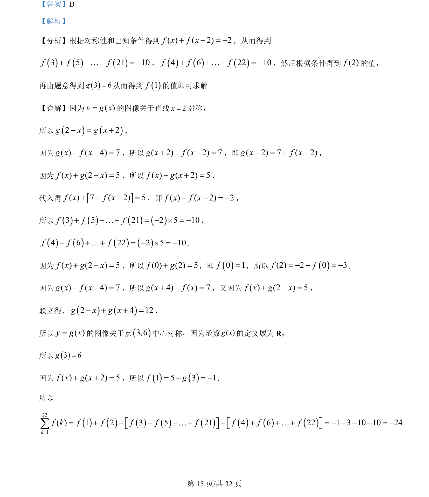
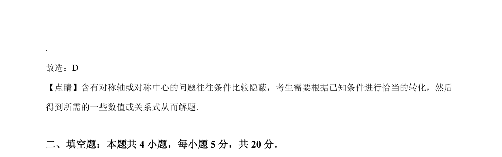

## 题面

## 摘要

利用函数对称性和方程关系，通过代换与求和求函数值。

## 关联考点

- [[681-函数对称性|函数对称性]]
- [[882-抽象函数|抽象函数]]
- [[647-代数变换|代数变换]]
- [[971-求值|求值]]

## 答案与解析

> 📄 原 PDF 第 15 页：`素材/真题/吉林/2008-2024·（吉林）数学高考真题/2022年高考数学试卷（理）（全国乙卷）（解析卷）.pdf`
