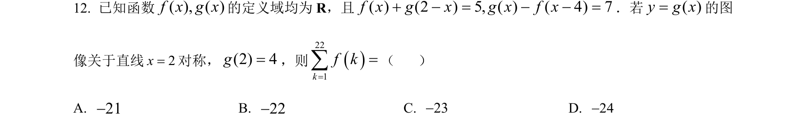
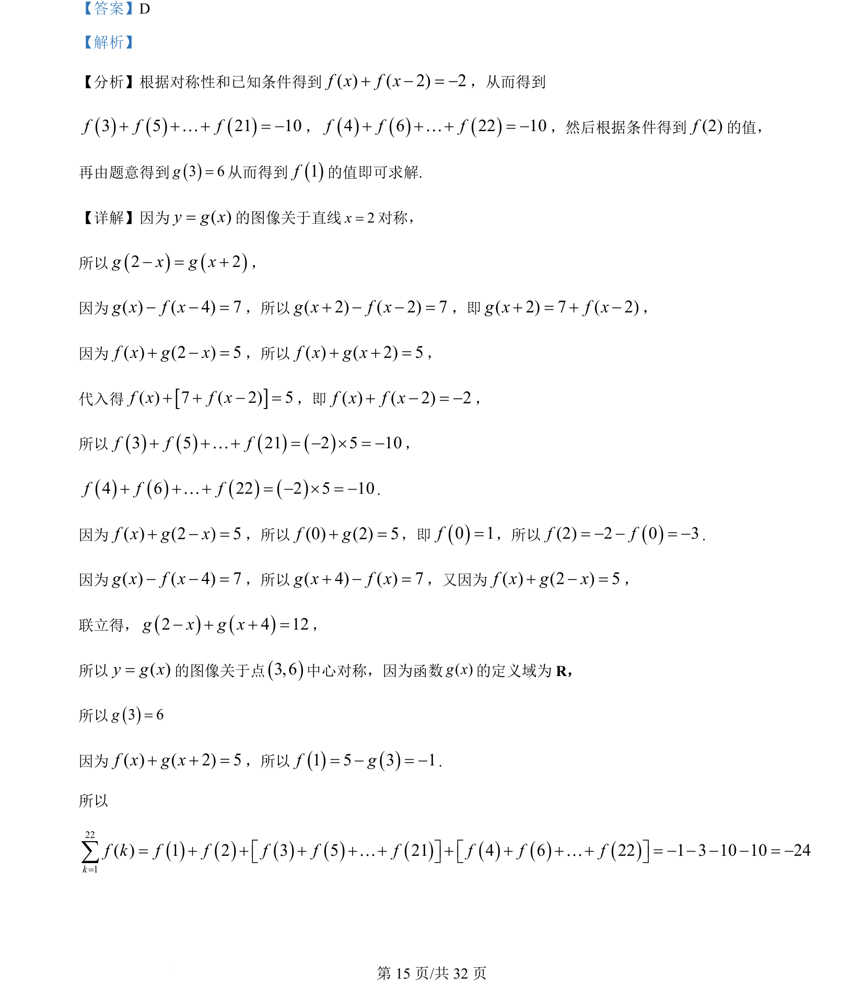
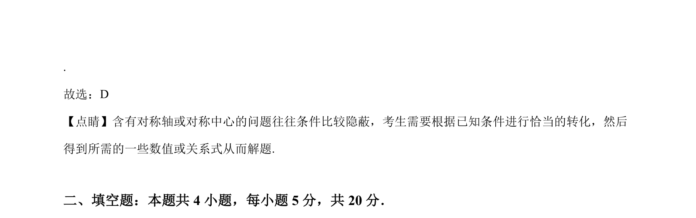

## 题面

## 摘要

利用函数对称性和方程关系，通过代换与求和求函数值。

## 关联考点

- [[681-函数对称性|函数对称性]]
- [[882-抽象函数|抽象函数]]
- [[647-代数变换|代数变换]]
- [[971-求值|求值]]

## 答案与解析

> 📄 原 PDF 第 15 页：`素材/真题/吉林/2008-2024·（吉林）数学高考真题/2022年高考数学试卷（理）（全国乙卷）（解析卷）.pdf`

<!-- 题干文本-start -->
## 题干文本
12. 已知函数( ), ( )f x g x的定义域均为 R，且( ) (2 ) 5, ( ) ( 4) 7f x g x g x f x+ - = - - =．若( )y g x=的图
像关于直线2x=对称，(2) 4g=，则221kf k==å（    ）
A. 21-B. 22-C. 23-D. 24-
<!-- 题干文本-end -->

<!-- 解析文本-start -->
## 解析文本
【答案】D
【解析】
【分析】根据对称性和已知条件得到( ) ( 2) 2f x f x+ - = -，从而得到
3 5 21 10f f f+ + + = -K，4 6 22 10f f f+ + + = -K，然后根据条件得到(2)f的值，
再由题意得到3 6g=从而得到1f的值即可求解.
【详解】因为( )y g x=的图像关于直线2x=对称，
所以2 2g x g x- = +，
因为( ) ( 4) 7g x f x- - =，所以( 2) ( 2) 7g x f x+ - - =，即( 2) 7 ( 2)g x f x+ = + -，
因为( ) (2 ) 5f x g x+ - =，所以( ) ( 2) 5f x g x+ + =，
代入得( ) 7 ( 2) 5f x f x+ + - =，即( ) ( 2) 2f x f x+ - = -，
所以3 5 21 2 5 10f f f+ + + = - ´ = -K，
4 6 22 2 5 10f f f+ + + = - ´ = -K.
因为( ) (2 ) 5f x g x+ - =，所以(0) (2) 5f g+ =，即0 1f=，所以 (2) 2 0 3f f= - - = -.
因为( ) ( 4) 7g x f x- - =，所以( 4) ( ) 7g x f x+ - =，又因为( ) (2 ) 5f x g x+ - =，
联立得，2 4 12g x g x- + + =，
所以( )y g x=的图像关于点3,6中心对称，因为函数( )g x的定义域为 R，
所以3 6g=
因为( ) ( 2) 5f x g x+ + =，所以1 5 3 1f g= - = -.
所以
2211 2 3 5 21 4 6 22 1 3 10 10 24( )kf f f f f f f ff k=+ + + + + + + + + = - - - - = -é ù é ùë û ë û=åK K
<!-- 解析文本-end -->
