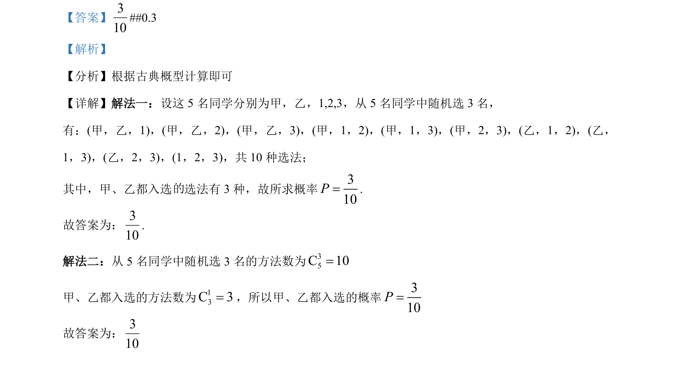

## 题面

## 摘要

5 名同学中随机选 3 名，求甲乙都入选的概率，用古典概型+组合数计算。

## 关联考点

- [[320-古典概型|古典概型]]
- [[504-组合数公式|组合数]]
- [[948-概率计算|概率计算]]

## 答案与解析

> 📄 原 PDF 第 16 页：`素材/真题/吉林/2008-2024·（吉林）数学高考真题/2022年高考数学试卷（理）（全国乙卷）（解析卷）.pdf`
