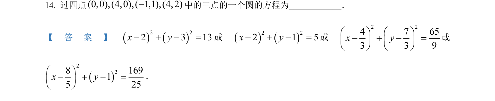
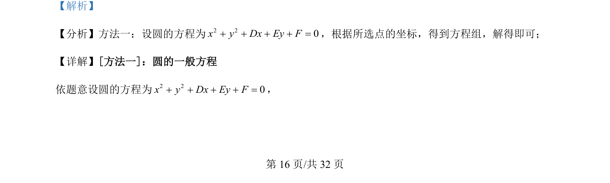
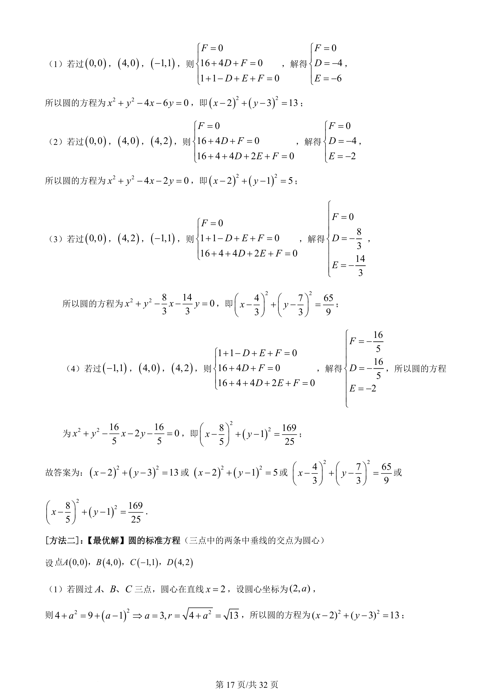
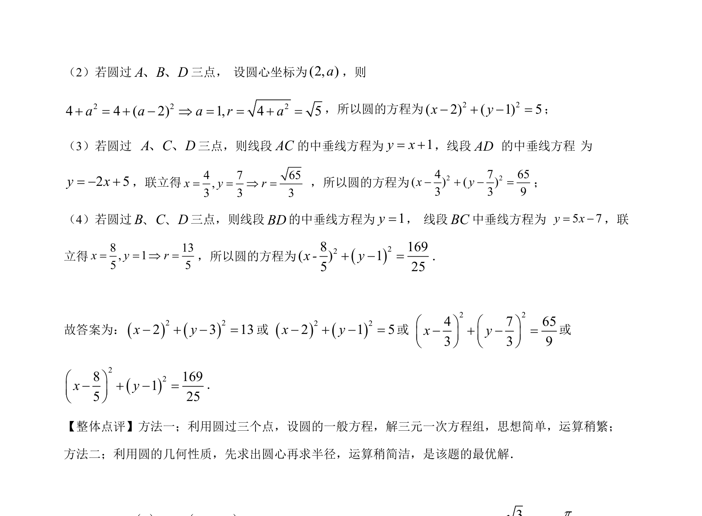

## 题面

## 摘要

考查根据不共线三点确定圆的方程，需设圆的一般式并代入求解。

## 关联考点

- [[372-圆的一般方程|圆的一般方程]]
- [[197-待定系数法|待定系数法]]
- [[1212-三点定圆|三点定圆]]

## 答案与解析

> 📄 原 PDF 第 16 页：`素材/真题/吉林/2008-2024·（吉林）数学高考真题/2022年高考数学试卷（理）（全国乙卷）（解析卷）.pdf`
