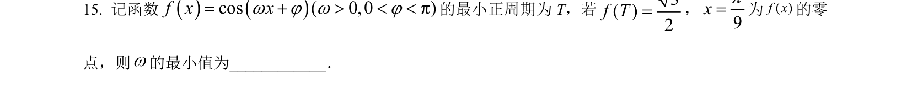
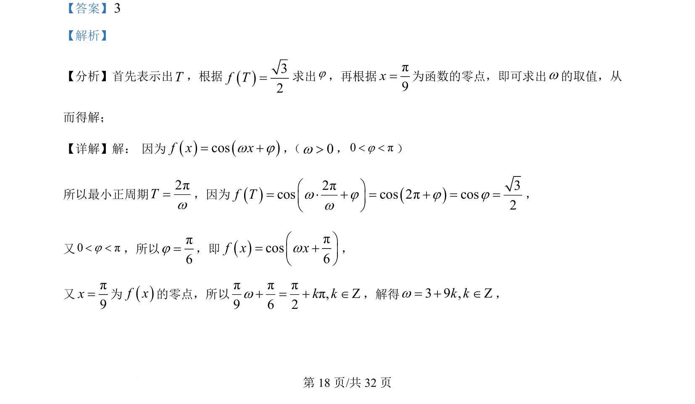
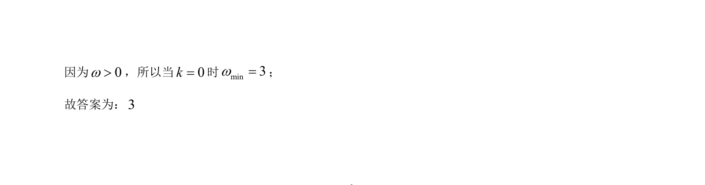

## 题面

## 摘要

三角函数求参问题，根据周期性和零点条件解出ω和φ。

## 关联考点

- [[270-三角函数应用|三角函数]]
- [[761-周期性|周期性]]
- [[288-函数零点|零点]]
- [[725-参数求解|参数求解]]

## 答案与解析

> 📄 原 PDF 第 18 页：`素材/真题/吉林/2008-2024·（吉林）数学高考真题/2022年高考数学试卷（理）（全国乙卷）（解析卷）.pdf`
