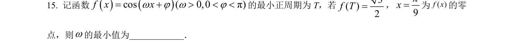
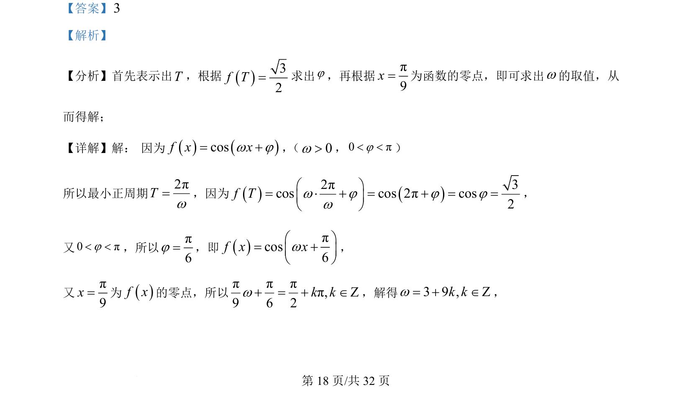
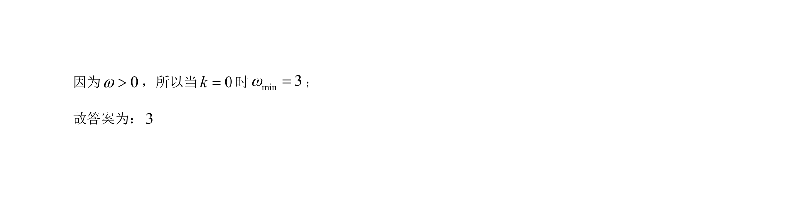

## 题面

## 摘要

三角函数求参问题，根据周期性和零点条件解出ω和φ。

## 关联考点

- [[270-三角函数应用|三角函数]]
- [[761-周期性|周期性]]
- [[288-函数零点|零点]]
- [[725-参数求解|参数求解]]

## 答案与解析

> 📄 原 PDF 第 18 页：`素材/真题/吉林/2008-2024·（吉林）数学高考真题/2022年高考数学试卷（理）（全国乙卷）（解析卷）.pdf`

<!-- 题干文本-start -->
## 题干文本
15. 记函数cos ( 0,0π)f x xw j w j= + > < <的最小正周期为 T，若3( )2f T=，
9xp=为( )f x的零
点，则w的最小值为____________．
<!-- 题干文本-end -->

<!-- 解析文本-start -->
## 解析文本
【答案】3
【解析】
【分析】首先表示出T，根据32f T=求出j，再根据π9x=为函数的零点，即可求出w的取值，从
而得解；
【详解】解： 因为cosf x xw j= +， （0w>，0πj< <）
所以最小正周期2πTw=，因为2π3cos cos 2πcos2f Tw j j jwæ ö= × + = + = =ç ÷è ø
，
又0πj< <，所以π6j=，即πcos6f x xwæ ö= +ç ÷è ø
，
又π9x=为f x的零点，所以ππππ, Z9 6 2k kw+ = + Î，解得3 9 , Zk kw= + Î，
<!-- 解析文本-end -->
