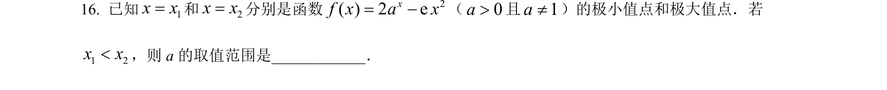
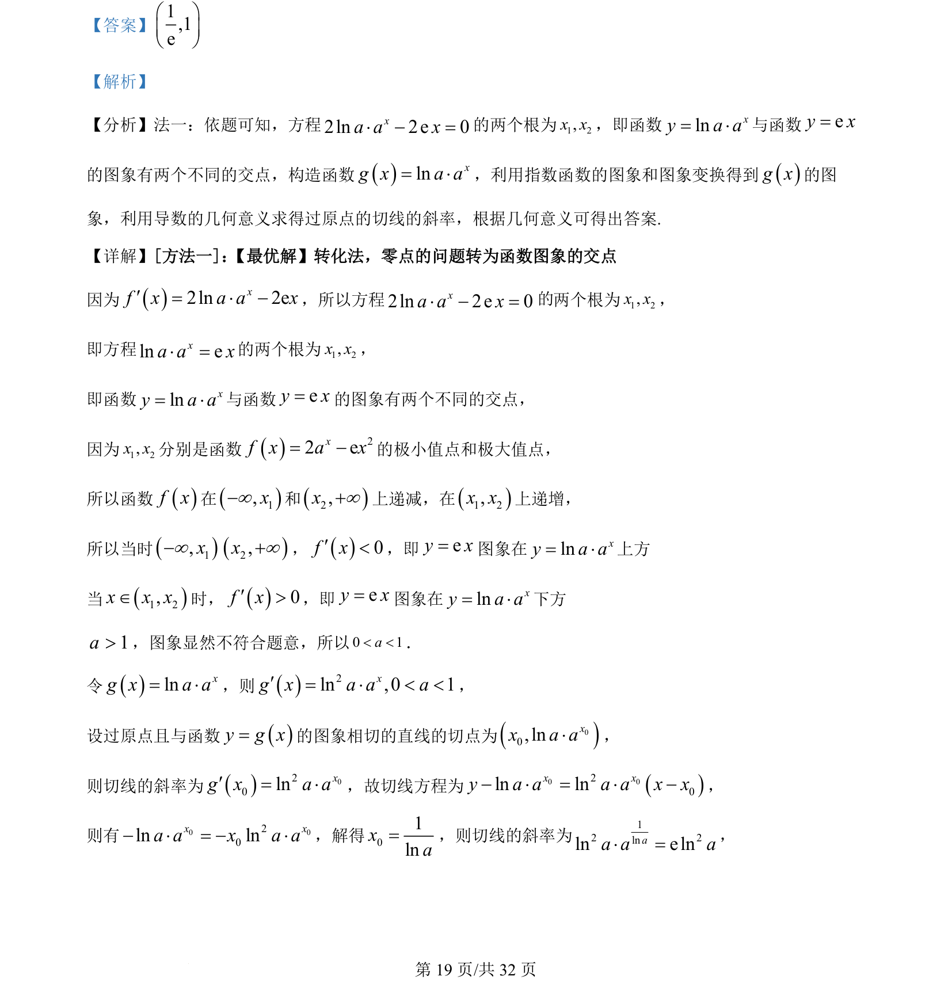

## 题面

## 摘要

本题考查利用导数研究函数零点问题，将方程根的问题转化为两个函数图象的交点，结合指数函数与切线斜率求解。

## 关联考点

- [[288-函数零点|函数零点]]
- [[导数几何意义]]
- [[304-指数函数|指数函数]]
- [[图象交点]]

## 答案与解析

> 📄 原 PDF 第 19 页：`素材/真题/吉林/2008-2024·（吉林）数学高考真题/2022年高考数学试卷（理）（全国乙卷）（解析卷）.pdf`
