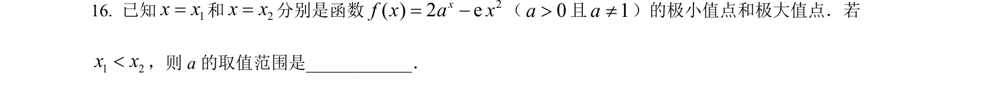
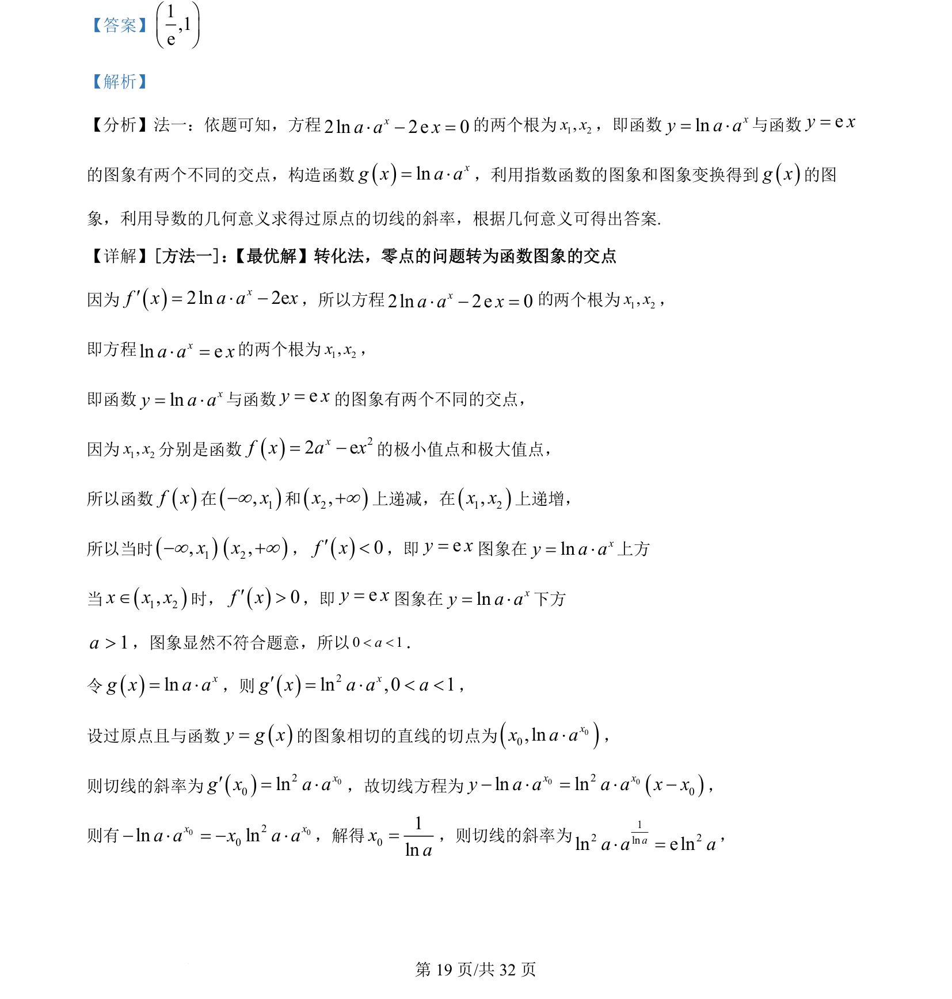
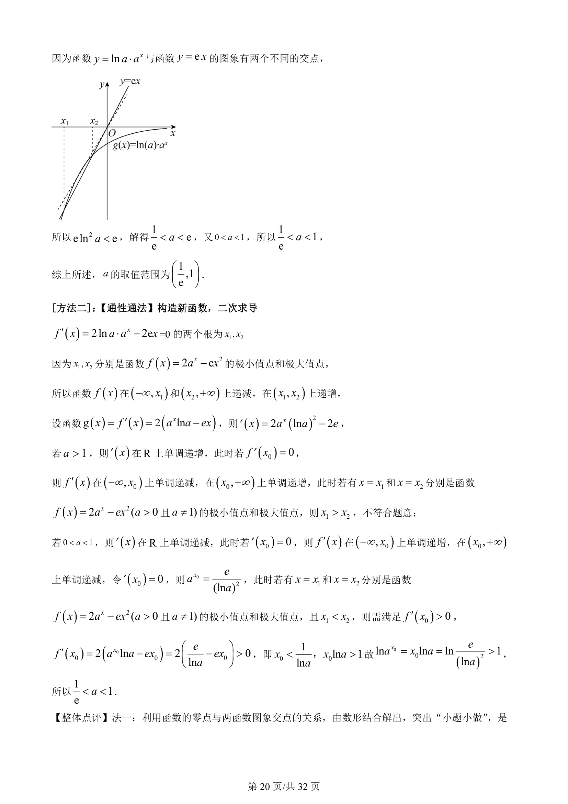
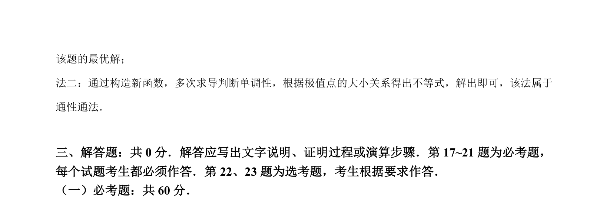

## 题面

## 摘要

f(x)=2a^x-ex²（a>0，a≠1）的极小值点x₁小于极大值点x₂，利用导数求极值点条件得参数a的取值范围。

## 关联考点

- [[425-反函数导数|导数]]
- [[918-极值点判别|极值点判别]]
- [[721-参数取值范围|参数取值范围]]
- [[304-指数函数|指数函数]]

## 答案与解析

> 📄 原 PDF 第 19 页：`素材/真题/吉林/2008-2024·（吉林）数学高考真题/2022年高考数学试卷（理）（全国乙卷）（解析卷）.pdf`

<!-- 题干文本-start -->
## 题干文本
16. 已知1xx=和2x x=分别是函数 2( ) 2 exf x a x= -（0a>且1a¹）的极小值点和极大值点．若
12xx<，则 a 的取值范围是____________．
<!-- 题干文本-end -->

<!-- 解析文本-start -->
## 解析文本
【答案】
1,1eæ öç ÷è ø
【解析】
【分析】法一：依题可知，方程2ln 2e 0xa a x× - =的两个根为1 2,x x，即函数lnxy a a= ×与函数ey x=
的图象有两个不同的交点，构造函数()lnxg x a a= ×，利用指数函数的图象和图象变换得到()g x的图
象，利用导数的几何意义求得过原点的切线的斜率，根据几何意义可得出答案.
【详解】[方法一]： 【最优解】转化法，零点的问题转为函数图象的交点
因为()2ln 2exf x a a x× -¢=，所以方程2ln 2e 0xa a x× - =两个根为1 2,x x，
即方程ln exa a x× =的两个根为1 2,x x，
即函数lnxy a a= ×与函数ey x=的图象有两个不同的交点，
因为1 2,x x分别是函数()22 exf x a x= -的极小值点和极大值点，
所以函数()f x在()1,x¥-和()2,x¥+上递减，在()1 2,x x上递增，
所以当时()1,x¥-()2,x¥+，()0f x¢<，即ey x=图象在lnxy a a= ×上方
当()1 2,x x xÎ时，()0f x¢>，即ey x=图象在lnxy a a= ×下方
1a>，图象显然不符合题意，所以0 1a< <．
令()lnxg x a a= ×，则()2ln ,0 1xg x a a a= × < <¢ ，
设过原点且与函数()y g x=的图象相切的直线的切点为()00,lnxx a a×，
则切线的斜率为()020lnxg x a a=¢×，故切线方程为 ()0 020ln lnx xy a a a a x x- × = × -，
则有 0 020ln lnx xa a x a a- × = - ×，解得01lnxa=，则切线的斜率为 12 2lnln elnaa a a× =，
的
<!-- 解析文本-end -->
