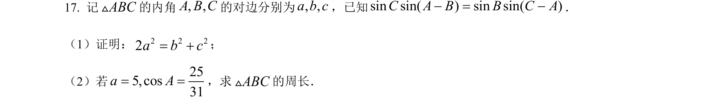
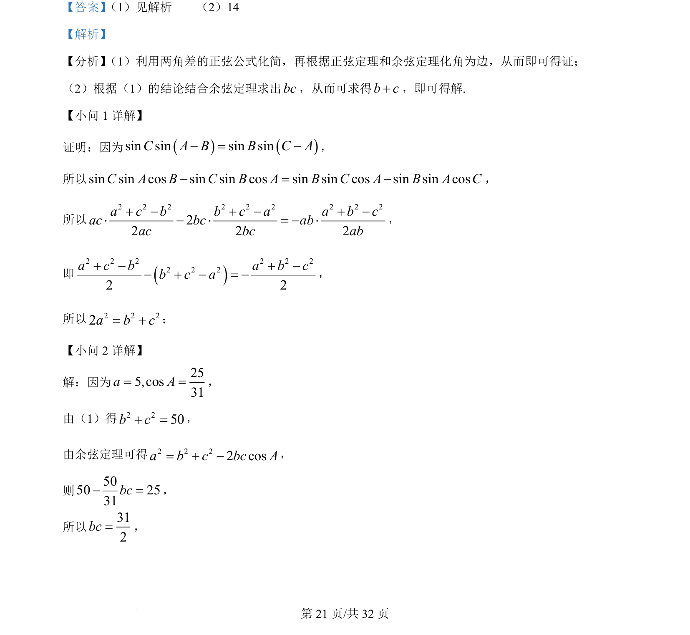

## 题面

## 摘要

本题考查利用正弦定理、余弦定理进行三角形边角互化证明与计算。

## 关联考点

- [[126-定理|正弦定理]]
- [[126-定理|余弦定理]]
- [[272-三角恒等变换|三角恒等变换]]

## 答案与解析

> 📄 原 PDF 第 21 页：`素材/真题/吉林/2008-2024·（吉林）数学高考真题/2022年高考数学试卷（理）（全国乙卷）（解析卷）.pdf`
