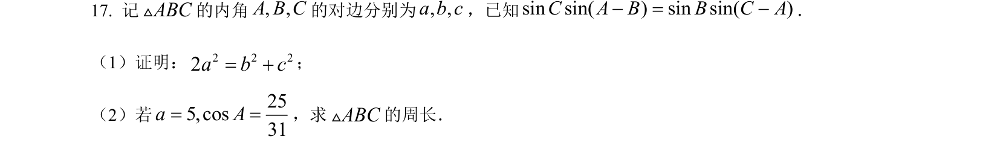
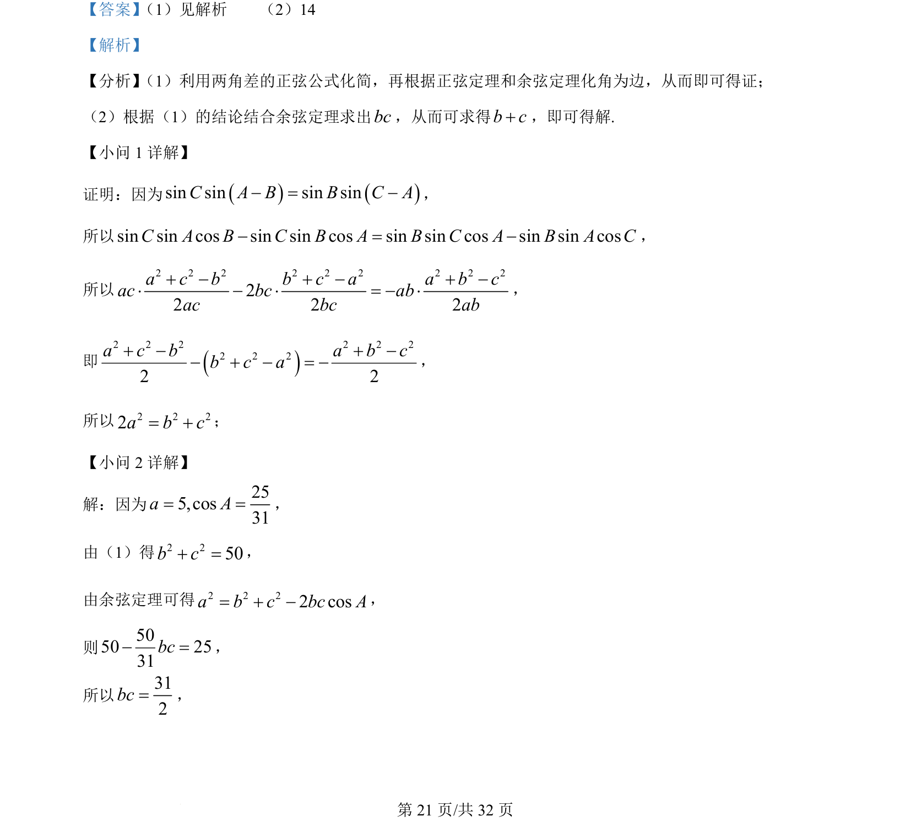
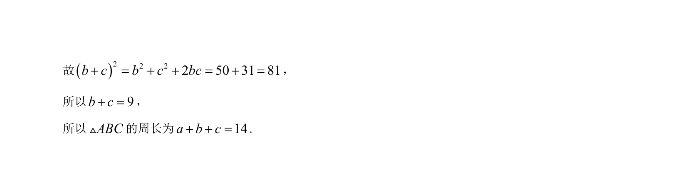

## 题面

## 摘要

本题考查利用正弦定理、余弦定理进行三角形边角互化证明与计算。

## 关联考点

- [[126-定理|正弦定理]]
- [[126-定理|余弦定理]]
- [[272-三角恒等变换|三角恒等变换]]

## 答案与解析

> 📄 原 PDF 第 21 页：`素材/真题/吉林/2008-2024·（吉林）数学高考真题/2022年高考数学试卷（理）（全国乙卷）（解析卷）.pdf`

<!-- 题干文本-start -->
## 题干文本
17. 记ABCV的内角, ,A B C的对边分别为, ,a b c，已知sin sin( ) sin sin( )C A B B C A- = -．
（1）证明：2 2 22a b c= +；
（2）若 255,cos31a A= =，求ABCV的周长．
<!-- 题干文本-end -->

<!-- 解析文本-start -->
## 解析文本
【答案】 （1）见解析    （2）14
【解析】
【分析】 （1）利用两角差的正弦公式化简，再根据正弦定理和余弦定理化角为边，从而即可得证；
（2）根据（1）的结论结合余弦定理求出bc，从而可求得b c+，即可得解.
【小问 1 详解】
证明：因为sin sin sin sinC A B B C A- = -，
所以sin sin cos sin sin cos sin sin cos sin sin cosC A B C B A B C A B A C- = -，
所以
2 2 2 2 2 2 2 2 222 2 2a c b b c a a b cac bc abac bc ab+ - + - + -× - × = - ×，
即2 2 2 2 2 22 2 22 2a c b a b cb c a+ - + -- + - = -，
所以2 2 22a b c= +；
【小问 2 详解】
解：因为 255,cos31a A= =，
由（1）得2 250b c+ =，
由余弦定理可得2 2 22 cosa b c bc A= + -， 
则5050 2531bc- =，
所以312bc=，
<!-- 解析文本-end -->
