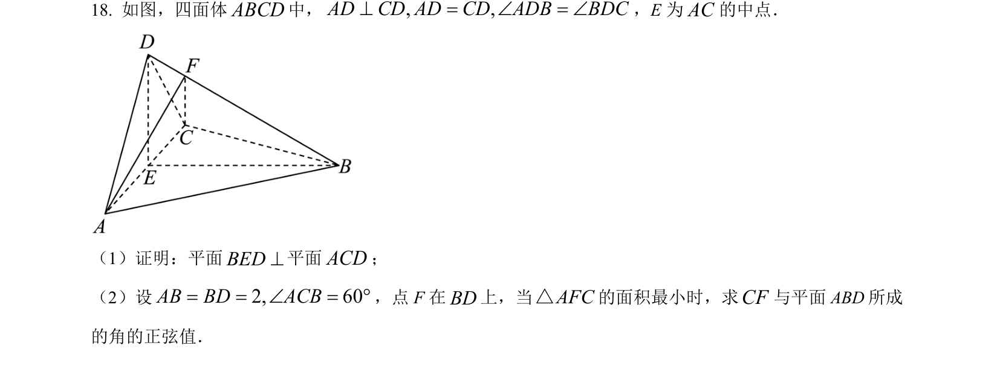
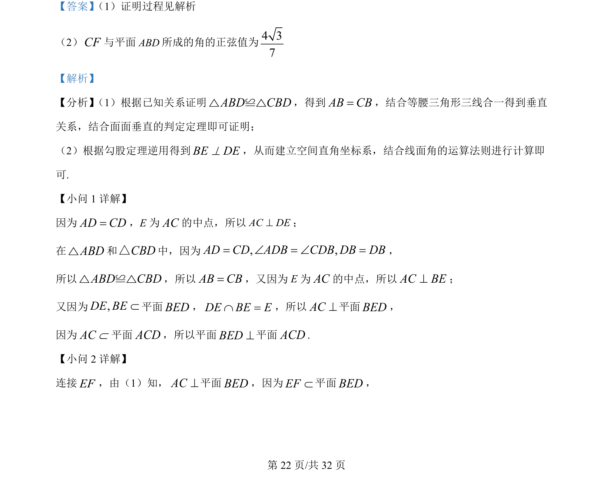
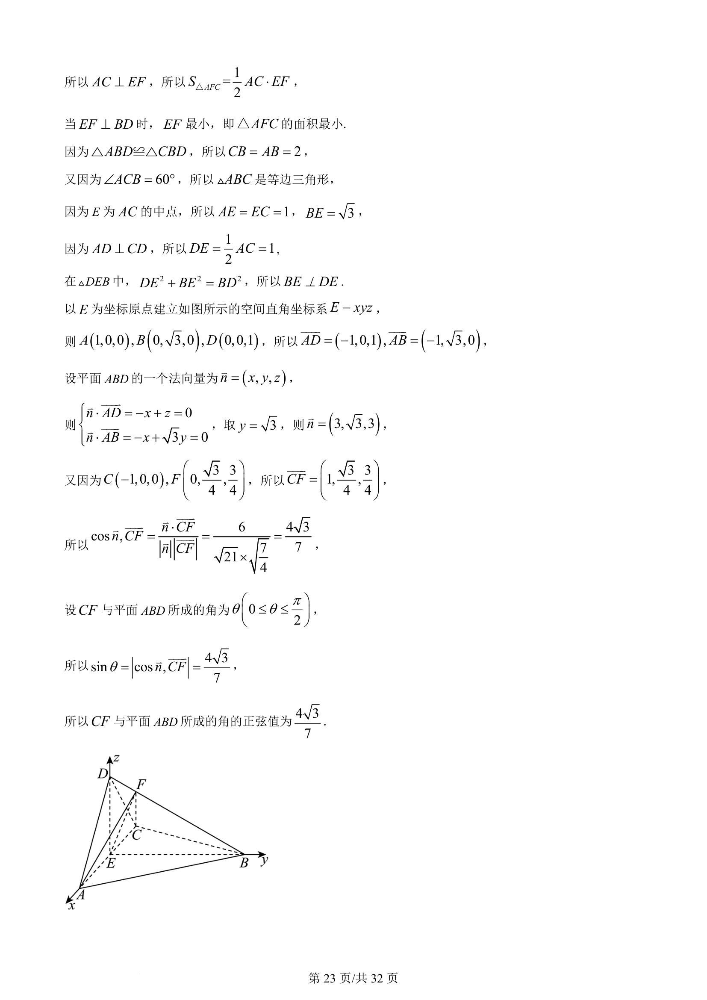

## 题面

## 摘要

本题考查立体几何中面面垂直的证明以及用空间向量法求解线面角及相关最值。

## 关联考点

- [[面面垂直判定]]
- [[线面垂直性质]]
- [[399-空间向量坐标表示|空间直角坐标系]]
- [[353-空间角|线面角]]

## 答案与解析

> 📄 原 PDF 第 22 页：`素材/真题/吉林/2008-2024·（吉林）数学高考真题/2022年高考数学试卷（理）（全国乙卷）（解析卷）.pdf`
