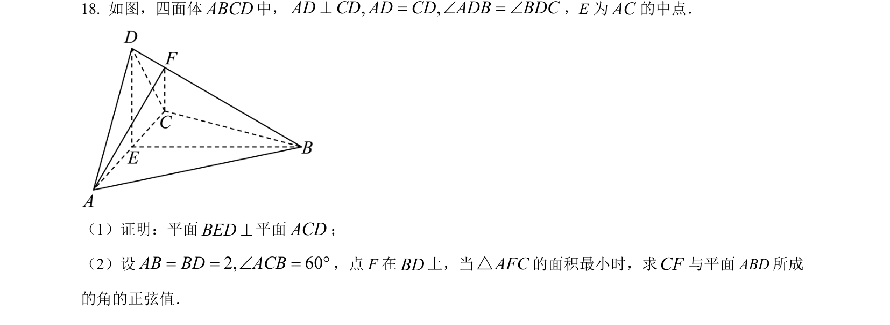
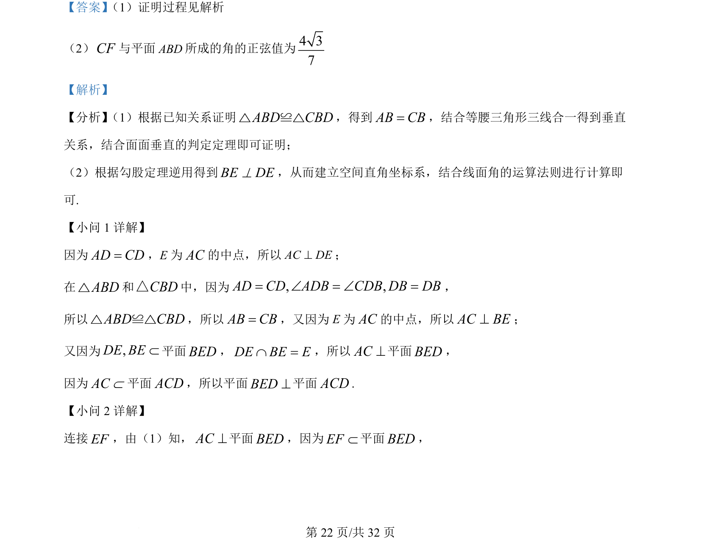
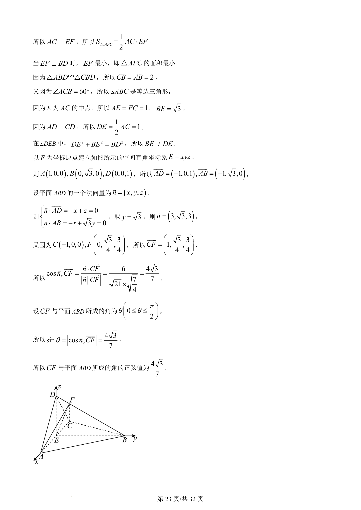

## 题面

## 摘要

本题考查立体几何中面面垂直的证明以及用空间向量法求解线面角及相关最值。

## 关联考点

- [[1149-面面垂直的判定|面面垂直判定]]
- [[584-线面垂直性质|线面垂直性质]]
- [[399-空间向量坐标表示|空间直角坐标系]]
- [[353-空间角|线面角]]

## 答案与解析

> 📄 原 PDF 第 22 页：`素材/真题/吉林/2008-2024·（吉林）数学高考真题/2022年高考数学试卷（理）（全国乙卷）（解析卷）.pdf`

<!-- 题干文本-start -->
## 题干文本
18. 如图，四面体ABCD中， , ,AD CD AD CD ADB BDC^ = Ð = Ð，E为AC的中点．
（1）证明：平面BED^平面ACD；
（2）设 2, 60AB BD ACB= = Ð =°，点 F在BD上，当AFC△的面积最小时，求CF与平面ABD所成
的角的正弦值．
<!-- 题干文本-end -->

<!-- 解析文本-start -->
## 解析文本
【答案】 （1）证明过程见解析    
（2）CF与平面ABD所成的角的正弦值为4 37
【解析】
【分析】 （1）根据已知关系证明ABD CBD≌△△，得到AB CB=，结合等腰三角形三线合一得到垂直
关系，结合面面垂直的判定定理即可证明；
（2）根据勾股定理逆用得到BE DE^，从而建立空间直角坐标系，结合线面角的运算法则进行计算即
可.
【小问 1 详解】
因为AD CD=，E为AC的中点，所以AC DE^；
在ABD△和CBD△中，因为,,BACD CDADB DB DB DÐ=Ð = =，
所以ABD CBD≌△△，所以AB CB=，又因为 E为AC的中点，所以AC BE^；
又因为,DE BEÌ平面BED，DE BE EÇ =，所以AC^平面BED，
因为ACÌ平面ACD，所以平面BED^平面ACD.
【小问 2 详解】
连接EF，由（1）知，AC^平面BED，因为EFÌ平面BED，
<!-- 解析文本-end -->
