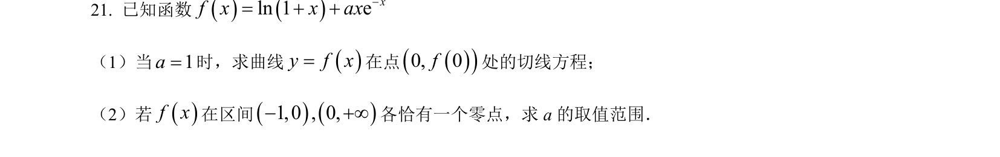
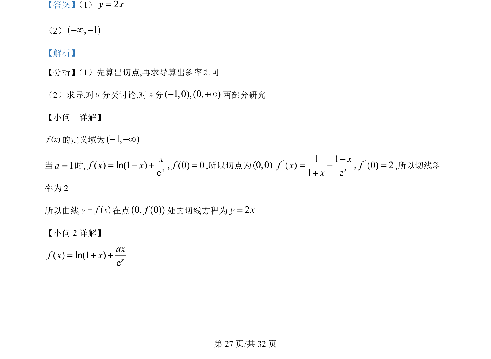

## 题面

## 摘要

考查导数几何意义求切线，以及含参函数单调性与零点问题的分类讨论。

## 关联考点

- [[440-导数的几何意义|导数的几何意义]]
- [[利用导数研究函数的单调性]]
- [[288-函数零点|函数的零点]]
- [[424-参数分类讨论|分类讨论]]

## 答案与解析

> 📄 原 PDF 第 27 页：`素材/真题/吉林/2008-2024·（吉林）数学高考真题/2022年高考数学试卷（理）（全国乙卷）（解析卷）.pdf`
