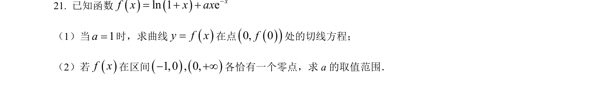
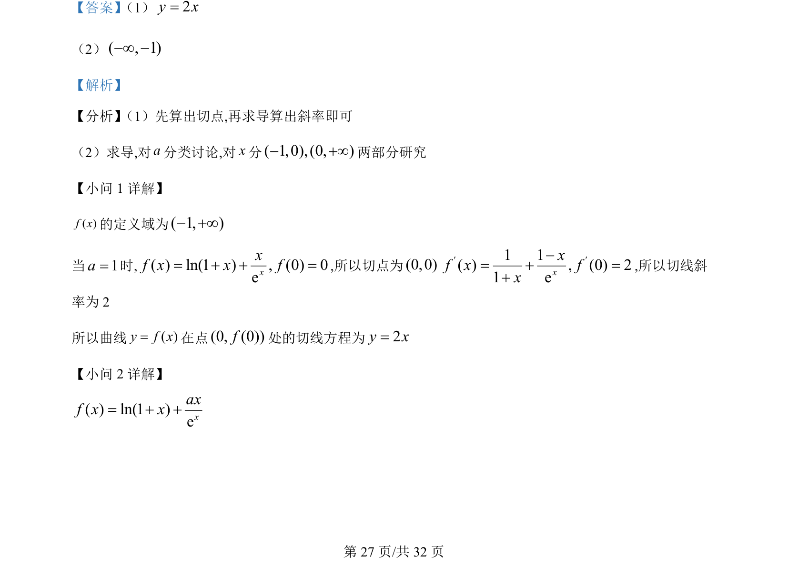
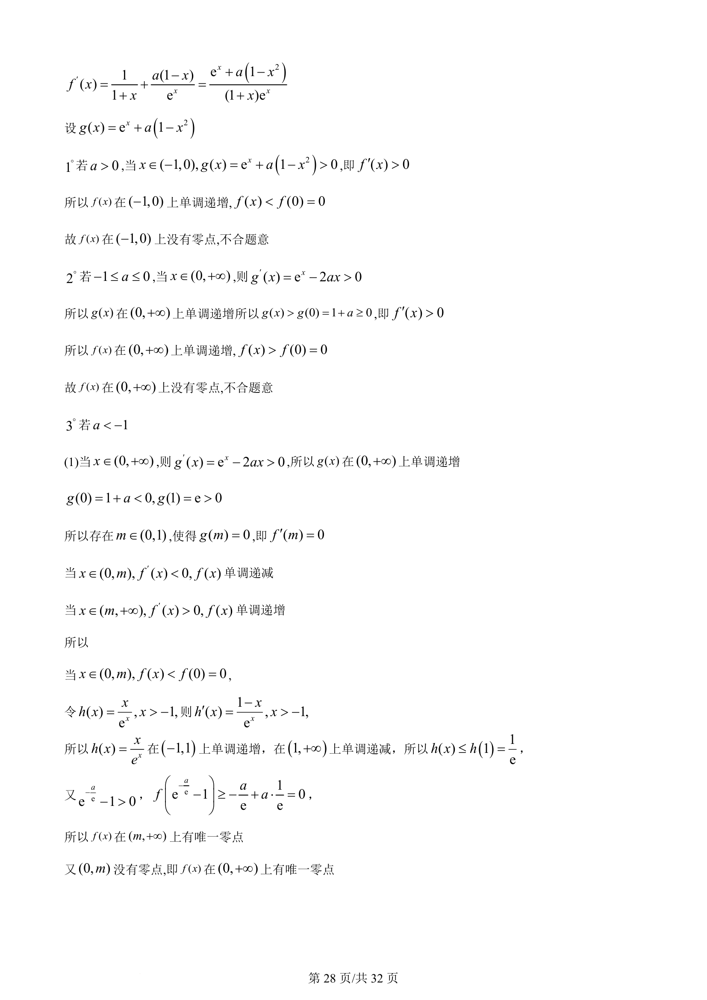
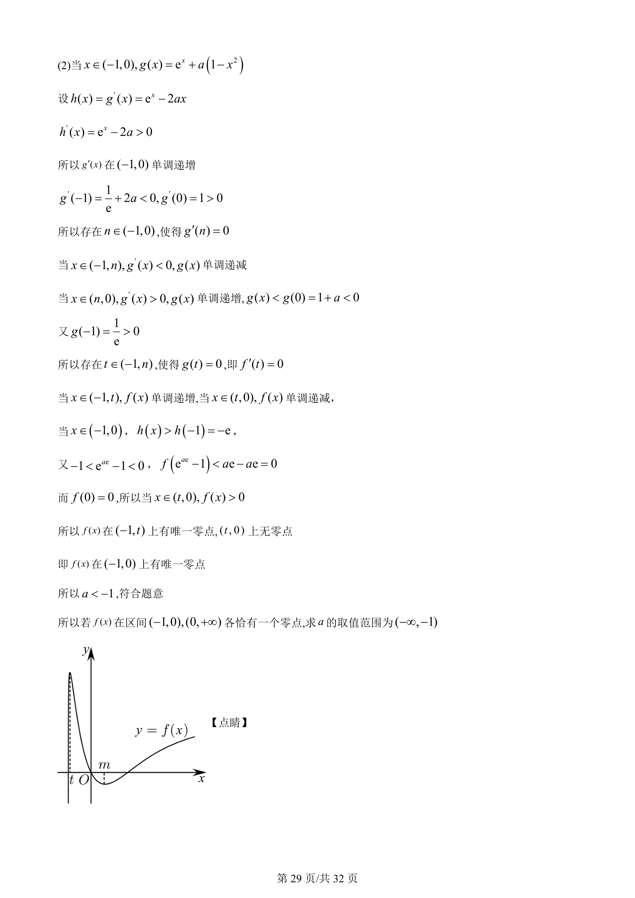
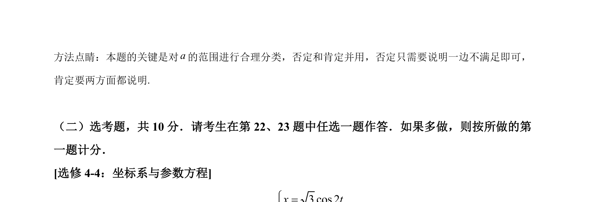

## 题面

## 摘要

考查导数几何意义求切线，以及含参函数单调性与零点问题的分类讨论。

## 关联考点

- [[440-导数的几何意义|导数的几何意义]]
- [[705-利用导数研究函数的单调性|利用导数研究函数的单调性]]
- [[288-函数零点|函数的零点]]
- [[424-参数分类讨论|分类讨论]]

## 答案与解析

> 📄 原 PDF 第 27 页：`素材/真题/吉林/2008-2024·（吉林）数学高考真题/2022年高考数学试卷（理）（全国乙卷）（解析卷）.pdf`

<!-- 题干文本-start -->
## 题干文本
21. 已知函数ln 1 exf x x ax-= + +
（1）当1a=时，求曲线y f x=在点0, 0f处的切线方程；
（2）若f x在区间1,0 , 0,- +¥各恰有一个零点，求 a 的取值范围．
<!-- 题干文本-end -->

<!-- 解析文本-start -->
## 解析文本
【答案】 （1）2y x=    
（2）( , 1)-¥ -
【解析】
【分析】 （1）先算出切点,再求导算出斜率即可
（2）求导,对a分类讨论,对x分( 1,0),(0, )- +¥两部分研究
【小问 1 详解】
( )f x的定义域为( 1, )- +¥
当1a=时,( ) ln(1 ) , (0) 0exxf x x f= + + =,所以切点为(0,0)1 1( ) , (0) 21 exxf x fx¢ ¢-= + =+
,所以切线斜
率为 2
所以曲线( )y f x=在点(0, (0))f处的切线方程为2y x=
【小问 2 详解】
( ) ln(1 )exaxf x x= + +
<!-- 解析文本-end -->
