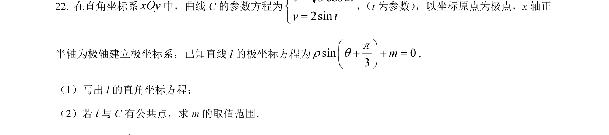
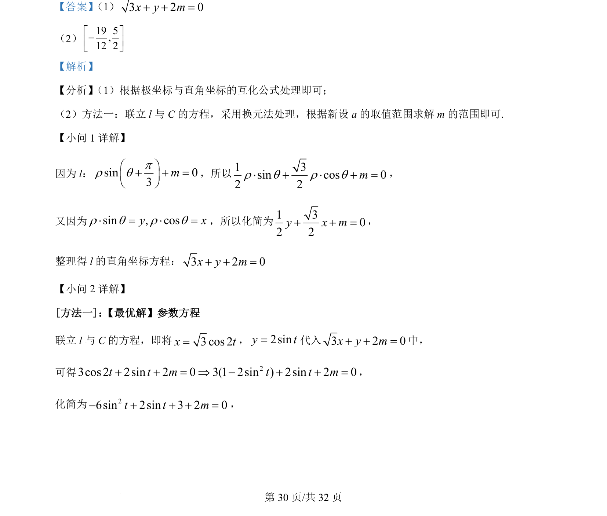
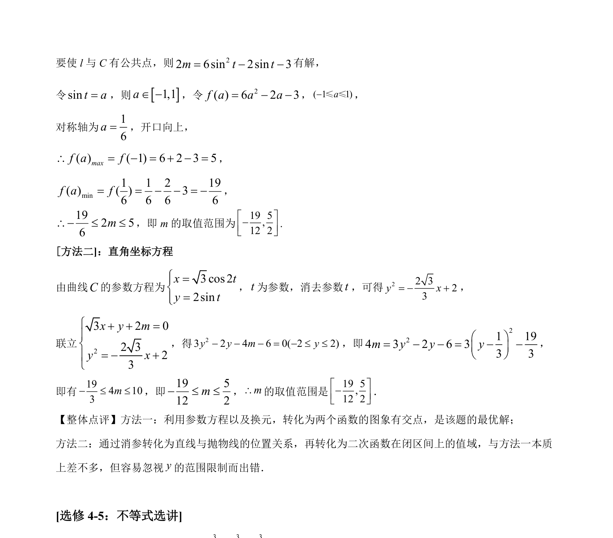

## 题面

## 摘要

极坐标与直角坐标互化，参数方程联立与换元法求参数范围

## 关联考点

- [[921-极坐标与直角坐标互化|极坐标与直角坐标互化]]
- [[061-方程|参数方程]]
- [[270-三角函数应用|三角函数]]
- [[676-函数值域|函数值域]]

## 答案与解析

> 📄 原 PDF 第 30 页：`素材/真题/吉林/2008-2024·（吉林）数学高考真题/2022年高考数学试卷（理）（全国乙卷）（解析卷）.pdf`
