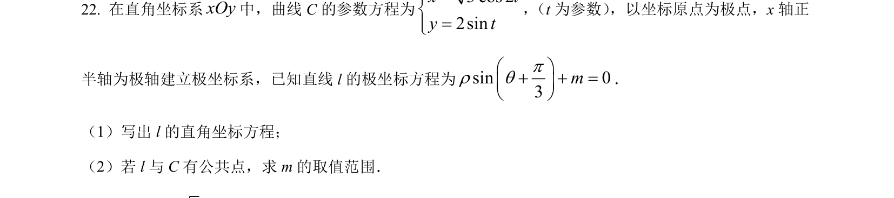
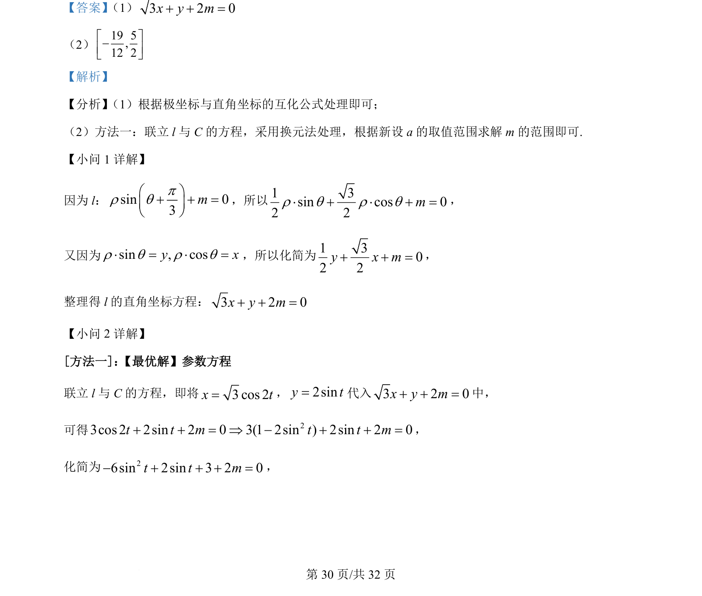
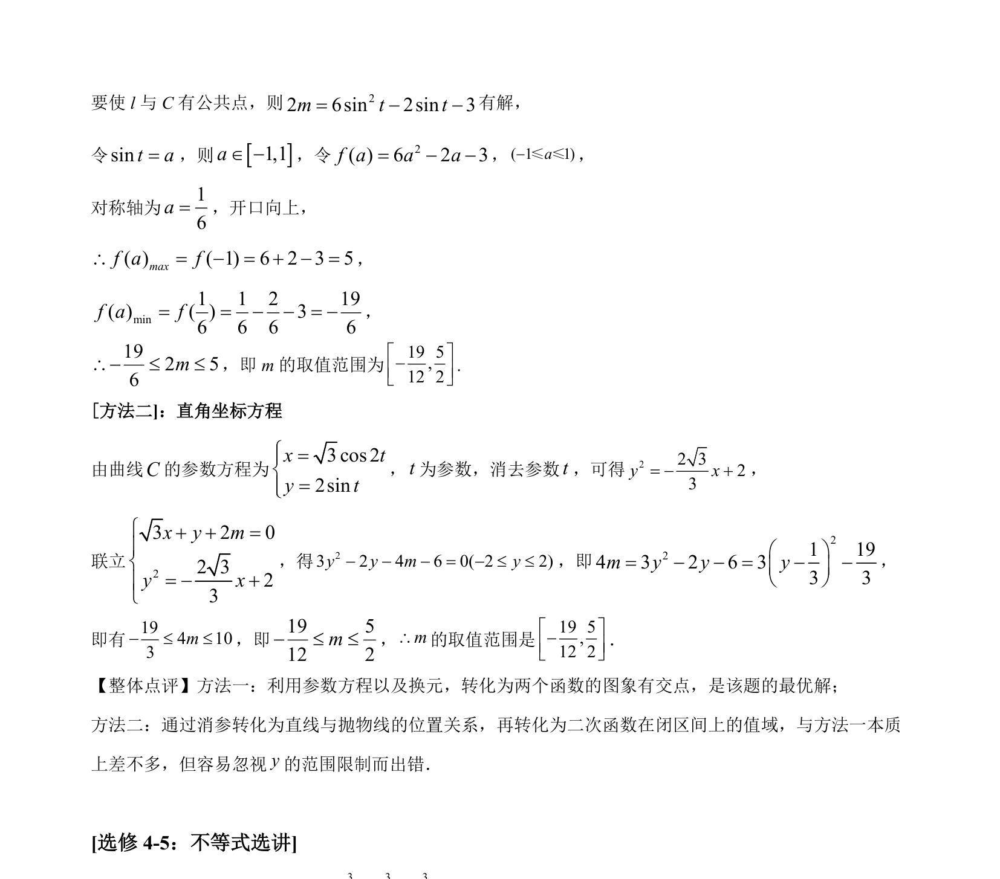

## 题面

## 摘要

极坐标与直角坐标互化，参数方程联立与换元法求参数范围

## 关联考点

- [[920-极坐标与直角坐标互化|极坐标与直角坐标互化]]
- [[061-方程|参数方程]]
- [[270-三角函数应用|三角函数]]
- [[676-函数值域|函数值域]]

## 答案与解析

> 📄 原 PDF 第 30 页：`素材/真题/吉林/2008-2024·（吉林）数学高考真题/2022年高考数学试卷（理）（全国乙卷）（解析卷）.pdf`

<!-- 题干文本-start -->
## 题干文本
22. 在直角坐标系xOy中，曲线 C的参数方程为3 cos 22sinx ty tì=ïí=ïî
， （t为参数） ，以坐标原点为极点，x轴正
半轴为极轴建立极坐标系，已知直线 l的极坐标方程为sin 03mpr qæ öç ÷è+ø+ =．
（1）写出 l的直角坐标方程；
（2）若 l与 C有公共点，求 m 的取值范围．
<!-- 题干文本-end -->

<!-- 解析文本-start -->
## 解析文本
【答案】 （1）3 2 0+ + =x y m    
（2）19 5,12 2é ù-ê úë û
【解析】
【分析】 （1）根据极坐标与直角坐标的互化公式处理即可；
（2）方法一：联立 l与 C的方程，采用换元法处理，根据新设 a 的取值范围求解 m 的范围即可.
【小问 1 详解】
因为 l：sin 03mpr qæ öç ÷è+ø+ =，所以1 3sin cos 02 2r q r q× + × + =m，
又因为sin , cosy xr q r q× = × =，所以化简为1 302 2+ + =y x m，
整理得 l的直角坐标方程：3 2 0+ + =x y m
【小问 2 详解】
[方法一]： 【最优解】参数方程
联立 l与 C的方程，即将3 cos 2=x t，2siny t=代入3 2 0+ + =x y m中，
可得 23cos 2 2sin 2 0 3(1 2sin ) 2sin 2 0t t m t t m+ + = Þ - + + =，
化简为 26sin 2sin 3 2 0- + + + =t t m，
<!-- 解析文本-end -->
