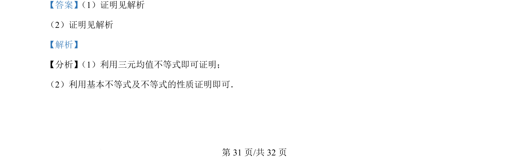
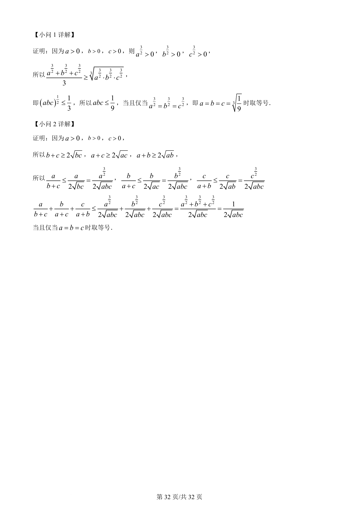

## 题面

## 摘要

本题考查三元均值不等式和基本不等式的应用，包括证明积与和的不等关系。

## 关联考点

- [[083-不等式|三元均值不等式]]
- [[295-基本不等式|基本不等式]]
- [[117-不等式性质|不等式性质]]

## 答案与解析

> 📄 原 PDF 第 31 页：`素材/真题/吉林/2008-2024·（吉林）数学高考真题/2022年高考数学试卷（理）（全国乙卷）（解析卷）.pdf`
