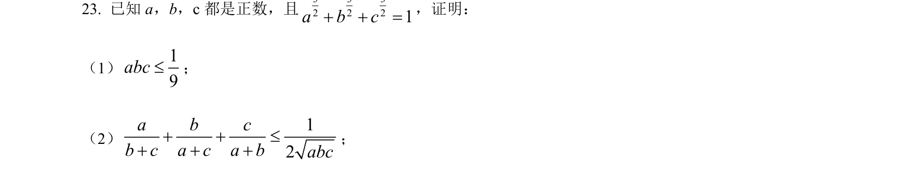
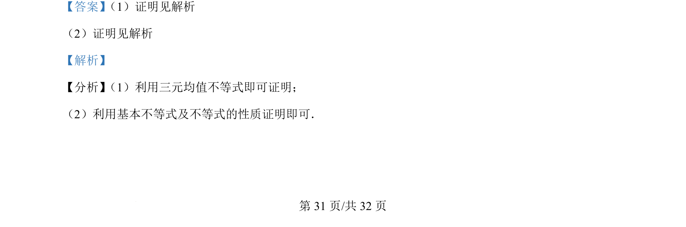
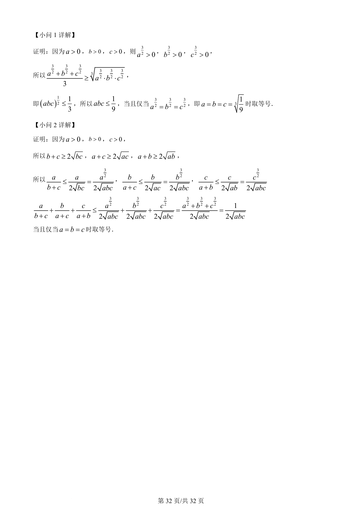

## 题面

## 摘要

本题考查三元均值不等式和基本不等式的应用，包括证明积与和的不等关系。

## 关联考点

- [[083-不等式|三元均值不等式]]
- [[295-基本不等式|基本不等式]]
- [[117-不等式性质|不等式性质]]

## 答案与解析

> 📄 原 PDF 第 31 页：`素材/真题/吉林/2008-2024·（吉林）数学高考真题/2022年高考数学试卷（理）（全国乙卷）（解析卷）.pdf`

<!-- 题干文本-start -->
## 题干文本
23. 已知 a，b，c都是正数，且3 3 32 2 21a b c+ + =，证明：
（1）19abc£；
（2）
12a b cb c a c a babc+ + £+ + +；
<!-- 题干文本-end -->

<!-- 解析文本-start -->
## 解析文本
【答案】 （1）证明见解析    
（2）证明见解析
【解析】
【分析】 （1）利用三元均值不等式即可证明；
（2）利用基本不等式及不等式的性质证明即可．
<!-- 解析文本-end -->
