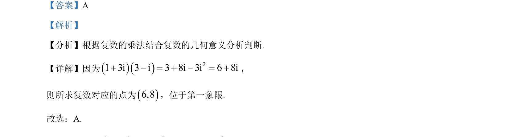

## 题面

## 摘要

该题考查复数乘法运算及复数在复平面内对应点所在象限的判断。

## 关联考点

- [[332-复数的乘除运算|复数乘法]]
- [[333-复数的几何意义|复数的几何意义]]

## 答案与解析

> 📄 原 PDF 第 1 页：`素材/真题/吉林/2008-2024·（吉林）数学高考真题/2023年高考数学试卷（新课标Ⅱ卷）（解析卷）.pdf`

<!-- 题干文本-start -->
## 题干文本
1. 在复平面内，()()13i3i+−对应的点位于（    ） ．
A. 第一象限 B. 第二象限 C. 第三象限 D. 第四象限
<!-- 题干文本-end -->

<!-- 解析文本-start -->
## 解析文本
【答案】A
【解析】
【分析】根据复数的乘法结合复数的几何意义分析判断.
【详解】因为()()21 3i 3 i 3 8i 3i 6 8i+ − = + − = +，
则所求复数对应的点为()6,8，位于第一象限.
故选：A.
<!-- 解析文本-end -->
