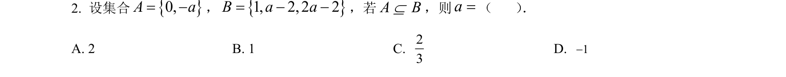
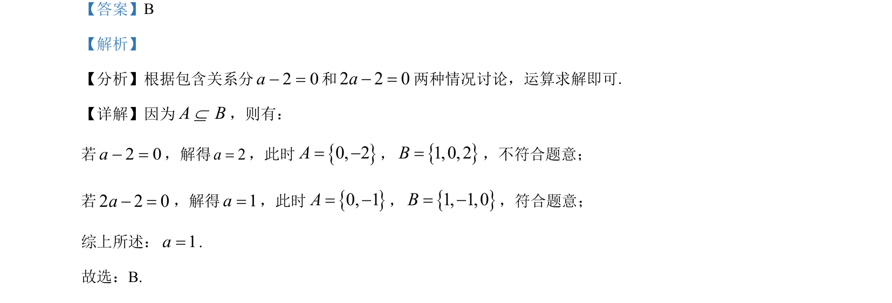

## 题面

## 摘要

根据集合包含关系分类讨论求参数值。

## 关联考点

- [[1137-集合包含关系|集合包含关系]]
- [[424-参数分类讨论|分类讨论]]
- [[725-参数求解|参数求解]]

## 答案与解析

> 📄 原 PDF 第 1 页：`素材/真题/吉林/2008-2024·（吉林）数学高考真题/2023年高考数学试卷（新课标Ⅱ卷）（解析卷）.pdf`

<!-- 题干文本-start -->
## 题干文本
2. 设集合0,Aa=，1,2,22Baa=，若A BÍ，则=a（    ） ．
A. 2 B. 1 C. 23D. 1
<!-- 题干文本-end -->

<!-- 解析文本-start -->
## 解析文本
【答案】B
【解析】
【分析】根据包含关系分2 0a =和2 2 0a =两种情况讨论，运算求解即可.
【详解】因为A BÍ，则有：
若2 0a =，解得2a=，此时0, 2A= ，1,0, 2B=，不符合题意；
若2 2 0a =，解得1a=，此时0, 1A= ，1, 1,0B= ，符合题意；
综上所述：1a=.
故选：B.
<!-- 解析文本-end -->
