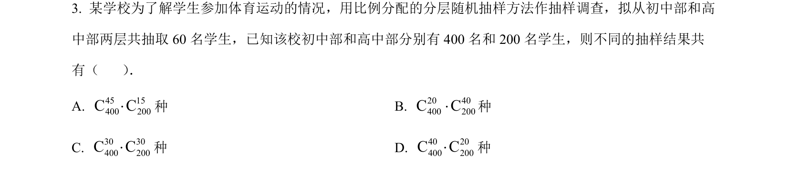
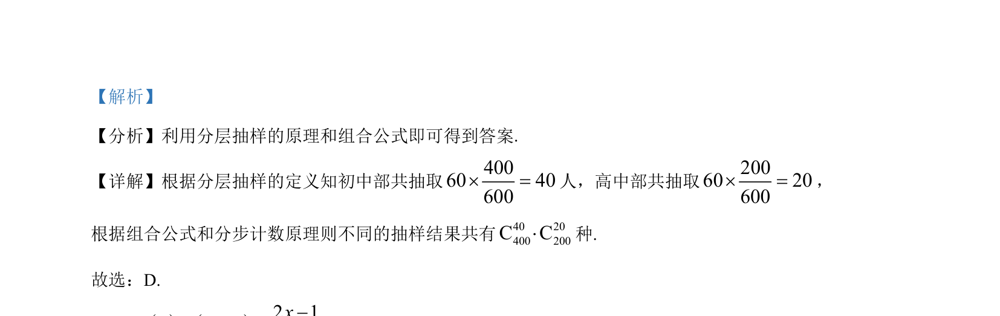

## 题面

## 摘要

该题考查分层抽样人数分配及组合计数基本方法，直接应用分层比例与组合公式求解。

## 关联考点

- [[319-分层抽样|分层抽样]]
- [[1090-组合计数|组合计数]]
- [[697-分步乘法计数原理|分步乘法计数原理]]

## 答案与解析

> 📄 原 PDF 第 1 页：`素材/真题/吉林/2008-2024·（吉林）数学高考真题/2023年高考数学试卷（新课标Ⅱ卷）（解析卷）.pdf`
